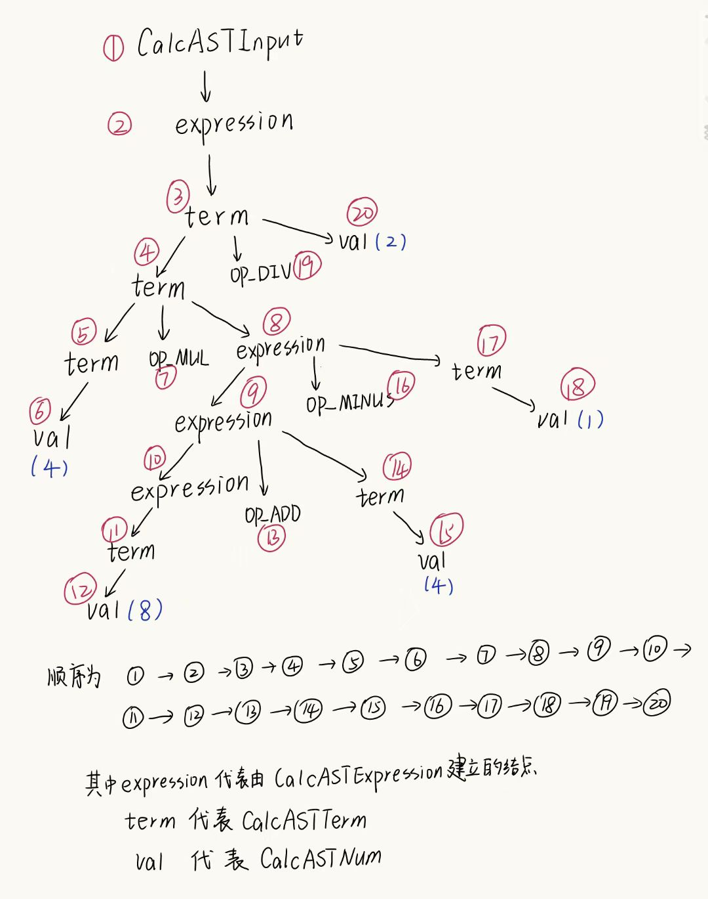

## Light IR 预热

**1.在 Light IR 手册里，你已经了解了 IR 代码的基本结构，请尝试编写一个有全局变量的 cminus 程序，并用 clang 编译生成中间代码，解释全局变量在其中的位置。**
```c
//cminus程序：
int a;
int main(void){
    a = 1;
    a = a + 1;
    return a;
}
```
```ll
; 中间代码
@a = dso_local global i32 0, align 4
define dso_local i32 @main() #0 {
  %1 = alloca i32, align 4
  store i32 0, i32* %1, align 4
  store i32 1, i32* @a, align 4
  %2 = load i32, i32* @a, align 4
  %3 = add nsw i32 %2, 1
  store i32 %3, i32* @a, align 4
  %4 = load i32, i32* @a, align 4
  ret i32 %4
}
```
- 全局变量`a`在`define`上面，使用`@a`符号表示地址。
- 可以看出其中全局变量位于`function`外。全局变量不在函数中，在整个程序中都有效，所以在中间代码中，全局变量不在`function`中，是直接写在`module`模块中，这样可以供`module`中所有部分使用。


**2. Light IR 中基本类型 label 在 Light IR C++ 库中是如何用类表示的？**
- `label`标识着一个基本块的出现，所以在`Light IR C++ 库`中用`BasicBlock`表示，当出现一个`label`时，创造一个该`label`的`BasicBlock`类。
- 此外，在`Type.hpp`文件中，`TypeID`中通过枚举量`LabelTyID`，来存储`label`。

  
    
      

**3. Light IR C++ 库中 Module 类中对基本类型与组合类型存储的方式是一样的吗？请尝试解释组合类型使用其存储方式的原因。**
- 不一样
- 存储基本类型，使用指向基本类型数据的智能指针。存储组合变量，通过引用其组成部分实现。大多采用`map`存储键值对，其中`key`是该组合类型的属性和其他信息等，`value`是指向该组合类型本身的智能指针。比如存储数组类型时，`value`是`std::unique_ptr<ArrayType>`，`key`包含了数组的元素类型和数量等基本信息。
- 采用这种键值对的方式存储组合类型实现对其组成类型的引用，可以保存组合类型附加的更多信息和符合其本身结构的更多信息。

**访问者模式的在下一页**

## 访问者模式

<!--  -->