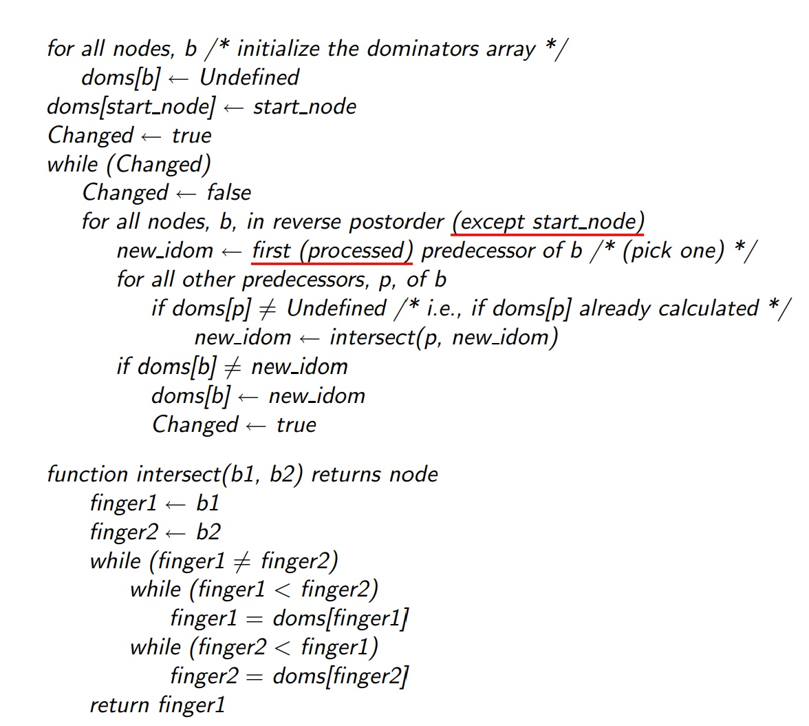

## lab4-phase1-Mem2Reg
### 1 实验流程

`Mem2Reg`阶段的主要目标是将内存访问转换为寄存器操作，从而优化运行时间。内存访问指令包含`alloca`，`load`，`store`等。对于某基本块涉及以上操作的变量，与支配该基本块的基本块有关。因此主要流程为
- **构造支配关系** &emsp; 构造基本块之间的关联
- **生成phi指令** &emsp; 通过支配关系，得到基本块的`phi`指令，从而处理变量在控制流汇合处的多个可能值。
- **重命名变量** &emsp; 对于涉及内存访问的变量，进行替换。从而将内存操作转化为寄存器操作。
### 1.1 构造支配关系
构造支配关系主要包括以下流程：创建函数的反向后序遍历序列-找直接支配-构造支配边界-构造支配树
#### 构造直接支配
根据伪代码，按照逆后序遍历结点，按照流图的逆后序`reverse post order`遍历结点，遍历结点的前驱结点，通过`intersect`函数找到所有前驱结点的公共前列结点，直至所有结点的直接支配结点`doms`不发生改变。

实现代码如下
```cpp
void Dominators::create_idom(Function *f) {
    // TODO 分析得到 f 中各个基本块的 idom
    auto entryBlock = f->get_entry_block();
    // 将入口块的直接支配者设置为自身
    idom_[entryBlock] = entryBlock;
    LOG(DEBUG) << idom_[entryBlock]->print();
    // 先计算支配结点
    // 若是直接支配节点，则除自身外的其他支配结点均在其直接支配节点的支配节点中
    bool changed = true;
    auto bbNum = post_order_vec_.size();
    // intersect 返回最近公共支配点，则对一个基本块，找到其所有preblock的最近公共块
    // 块是从0开始编码的
    while (changed) {
        changed = false;
        // in reverse postorder
        for(int i = bbNum - 2; i >= 0; i--){
            auto block = post_order_vec_[i];
            // int dom_temp = -1;
            BasicBlock *new_idom = block->get_pre_basic_blocks().front();
            // 遍历前驱block
            for(auto &pred_block : block->get_pre_basic_blocks()){
                if(idom_[pred_block] != nullptr){
                    new_idom = intersect(new_idom, pred_block);
                }
            }
            if(idom_[block] != new_idom){
                idom_[block] = new_idom;
                changed = true;
            }
        }
    }
}
```
#### 构造支配边界
若对于一条路径`a -> b`， `a`所在的基本块`A`不直接支配`b`所在的基本块`B`，则`A`的支配边界包含基本块`B`，在由`A`向上遍历，直至找到`B`的直接支配，此过程中所有基本块的支配边界均包含`B`。
伪代码如下


实现代码如下
```cpp
void Dominators::create_dominance_frontier(Function *f) {
    // TODO 分析得到 f 中各个基本块的支配边界集合
    // dom_frontier_ 代表支配边界
    for(auto &block : f->get_basic_blocks()){
        for(auto &pred_block : block.get_pre_basic_blocks()){
            if(idom_[&block] == pred_block){
                continue;
            }
            else{
                auto temp = pred_block;
                while (idom_[&block] != temp) {
                    dom_frontier_[temp].insert(&block);
                    // dom_frontier_[pred_block].emplace(&block);
                    temp = idom_[temp];                    
                }
            }
        }
    }
}
```

#### 构造支配树
若`A`是`B`的直接支配者，则`B`是`A`在支配树上的后继，因此遍历所有基本块，即可构造支配树。若该块为`entry block`，没有直接支配。
实现代码如下
```cpp
void Dominators::create_dom_tree_succ(Function *f) {
    // TODO 分析得到 f 中各个基本块的支配树后继
    // dom_tree_succ_blocks_
    for(auto &block : f->get_basic_blocks()){
        if(&block == f->get_entry_block()){
            continue;
        }
        auto dom = idom_[&block];
        dom_tree_succ_blocks_[dom].emplace(&block);
    }
    // throw "Unimplemented create_dom_tree_succ";
}
```
以下列代码为例
```c
int factorial(int a) { 
    if(a==0) 
        return 1;
    else
        return a*factorial(a-1); 
}
```

得到的支配关系如下所示，可知正确性。

#### 1.2 构造`phi`指令
若一个基本块有多个前驱块，对于不同前驱块中的相同变量，使用`phi`指令对其进行选择，从而用一条指令合并相同变量的不同值。
##### 生成`phi`指令
包含收集全局活跃变量和插入`phi`指令操作，已经进行了实现
##### 变量重命名
对于相同变量，使用栈结构存储其最新值，若遇到使用该变量的情况，则使用栈顶元素进行替换。
- 遍历指令，若是`load`指令，则根据变量找到栈顶元素，替换该指令涉及的变量；若为`store`指令，则找到变量对应栈，更新栈顶元素。
- 对于该基本块的后继基本块，若后继基本块中存在`phi`指令，对于`phi`指令涉及的变量，插入对应的栈顶元素和来源基本块，从而完善`phi`指令。
- 对于该基本块的直接后继块，后继块中的变量与当前块有关，对后继块同样执行重命名操作。
- 每遍历完一个基本块，对于该基本块带来的变量栈，进行回退。
- 删除涉及的`load`，`store`和`alloca`指令

具体代码如下：
```cpp
void Mem2Reg::rename(BasicBlock *bb) {
    std::vector<Instruction *> wait_delete;
    // TODO
    // 步骤一：将 phi 指令作为 lval 的最新定值，lval 即是为局部变量 alloca 出的地址空间
    for(auto &instr : bb->get_instructions()){
        if(instr.is_phi()){
            // 获取对应的值
            auto lval = phi_lval[static_cast<PhiInst *>(&instr)];
            var_val_stack[lval].push_back(&instr);
        }
        else if(instr.is_load()){
            // 
            // is_valid_ptr()
            // 获取load指令的地址
            auto lval = instr.get_operand(0);
            // 判断is_valic_ptr
            if(is_valid_ptr(lval) ){
                // 获取栈顶元素
                if(var_val_stack.find(lval) == var_val_stack.end()){
                    continue;
                }
                if(var_val_stack[lval].empty()){
                    continue;
                }
                auto val = var_val_stack[lval].back();
                instr.replace_all_use_with(val);
                wait_delete.push_back(&instr);
            }            
            // wait_delete.push_back(&instr);
        }
        else if(instr.is_store()){
            // 获取地址
            auto rval = instr.get_operand(1);
            if(is_valid_ptr(rval)){
                auto lval = instr.get_operand(0);
                var_val_stack[rval].push_back(lval);
                wait_delete.push_back(&instr);
            }
            // wait_delete.push_back(&instr);
        }
        else if(instr.is_alloca()){
            if(!instr.get_type()->get_pointer_element_type()->is_array_type() && is_valid_ptr(&instr))
                wait_delete.push_back(&instr);
        }

    }
    // 步骤二：用 lval 最新的定值替代对应的load指令
    // 步骤三：将 store 指令的 rval，也即被存入内存的值，作为 lval 的最新定值
    // 步骤四：为 lval 对应的 phi 指令参数补充完整
    // 把phi指令的其他部分补充， 当前phi和pre有关
    // for(auto &pre_bb: bb->get_pre_basic_blocks())
    // 填写后继的phi，回填
    for(auto &succ_bb : bb->get_succ_basic_blocks()){
        for(auto &instr : succ_bb->get_instructions()){
            if(instr.is_phi()){
                // 找到phi指令
                // 找到对应的lval
                auto lval = phi_lval[static_cast<PhiInst *>(&instr)];
                // 找到此时lval的栈顶值
                if(var_val_stack[lval].empty()){
                    continue;
                }
                auto top_val = var_val_stack[lval].back();
                auto phiInst = static_cast<PhiInst *>(&instr);
                phiInst->add_phi_pair_operand(top_val, bb);
            }
        }
    }

    // 步骤五：对 bb 在支配树上的所有后继节点，递归执行 re_name 操作

    for(auto &succ_bb : dominators_->get_dom_tree_succ_blocks(bb)){
        rename(succ_bb);
    }
    // 步骤六：pop出 lval 的最新定值
    // 在rename后，返回上一级的lval值
    for(auto &instr : bb->get_instructions()){
        // 被改变的值有store和phi
        if(instr.is_store()){
            auto lval = instr.get_operand(1);
            if(is_valid_ptr(lval)){
                var_val_stack[lval].pop_back();
            }
        }
        else if(instr.is_phi()){
            auto lval  = phi_lval[static_cast<PhiInst*>(&instr)];
            var_val_stack[lval].pop_back();
        }
    }
    // 步骤七：清除冗余的指令
    for (auto instr : wait_delete) {
        bb->erase_instr(instr);
    }
}
```


### 2 正确性验证
以函数`7-assign_int_var_local.cminus`为例
- **`7-assign_int_var_local.cminus`**
```c
int main(void) {
    int a;
    a = 1234;
    return a;
}
```
- 未经优化的指令如下
```c
define i32 @main() {
label_entry:
  %op0 = alloca i32
  %op1 = load i32, i32* %op0
  store i32 1234, i32* %op0
  %op2 = load i32, i32* %op0
  ret i32 %op2
}
```
- 经过处理后的中间代码，可见对`alloca`，`store`，和`load`指令进行了优化，最终只需一条`ret`指令直接返回整数。
```
define i32 @main() {
label_entry:
  ret i32 1234
}
```

对于其他函数


### 3 性能分析
根据分析可得，时间上得到了优化。
