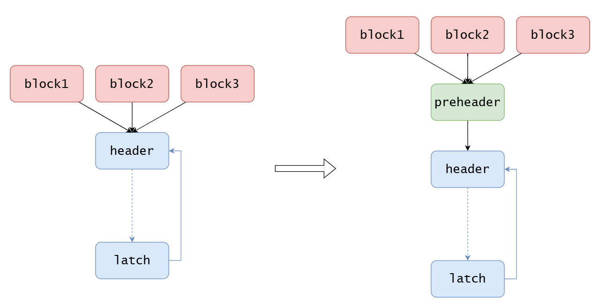
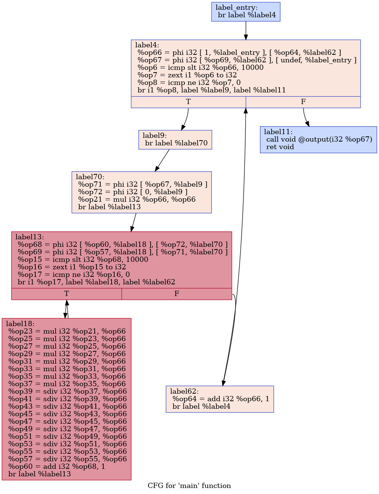
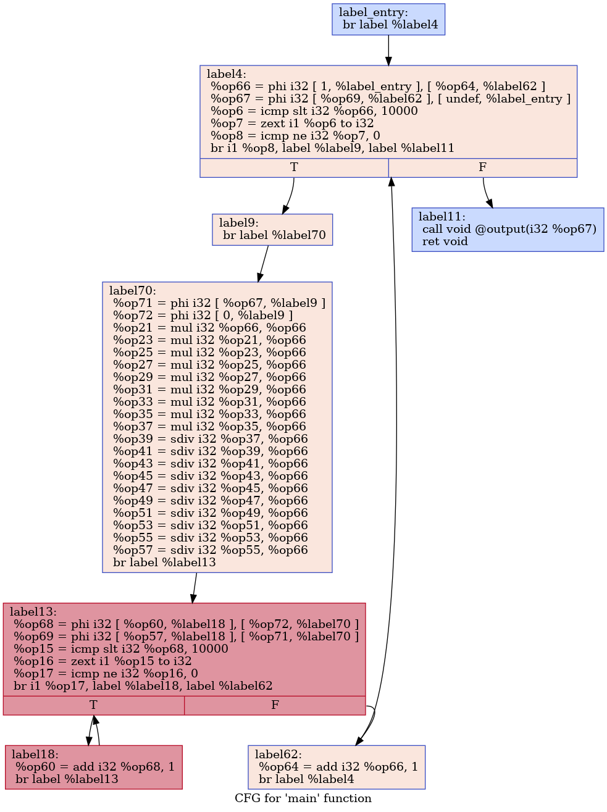
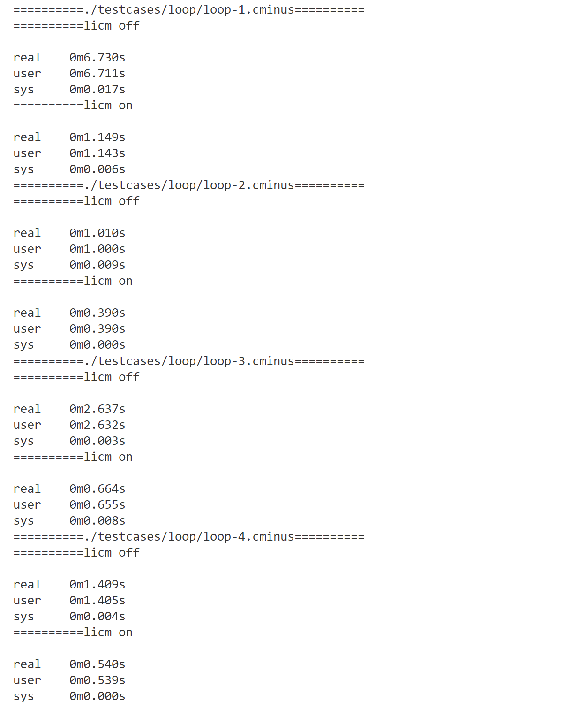

## Lab4 phase2 Report
### 0 实验介绍
在循环结构中，可能存在着变量在整个循环过程中值并未发生改变，一直在进行重复计算，这个过程会带来不必要的开销，因此本实验阶段对循环过程进行优化，从而把循环不变量提取到循环外部。主要包含步骤为：**找出循环及其层次结构--> 找出循环不变量 --> 创建`preheader`并修改`phi`指令 --> 修改支配关系  --> 将循环不变式提取到`preheader`中**。

### 1 实验设计
#### 1.1 找出循环`LoopDetection`
**主要相关定义**：
- `header`：循环头，回边指向的块，循环开始的位置。
- `latch`：循环中回边的起始块。

**主要流程如下**：
- 使用`bb_to_loop_[bb]`来表示基本块`bb`对应的循环`loop`。
- 按照支配树后序遍历基本块，检测每个块的前驱是否存在回边，若存在回边则说明存在循环，所以创建新的循环，并检测该循环的循环体和子循环。
- **检测循环体和子循环**：初始化`work_list`，首先加入所有`latch`块，从`work_list`中逐个取出块，判断该块是否已经对应了循环结构。
  - 若该块未分配给任何循环，则设置该块对应的循环为当前`loop`，并将该块对应的前驱块加入`work_list`，此过程可以从`latch`开始，按照支配结构自底向上，找到对应的的循环体。
  - 若该块已经分配了某个循环，说明该块在两个循环中，即存在着循环嵌套结构，接着构造循环的层级关系。由于是按照后序遍历，所以先得到的循环往往是子循环，则该块所属的循环为子循环，接着找到该循环对应的最高级父循环，找到后与当前循环构造嵌套结构。由于子循环在父循环的范围内，所以把子循环的所有基本块加入到父循环中，把子循环的`header`的前驱加入到工作表中，进而找出所有循环块。
  **该部分对应代码为**
  ```CPP
    else if (bb_to_loop_[bb] != loop) {
      auto bbLoop = bb_to_loop_[bb];  // 获取该基本块对应的loop
      auto parentLoop = bbLoop;
      // 找到最顶层父循环
      while(parentLoop->get_parent() != nullptr){
         auto parentLoop = bbLoop->get_parent();
      }
      // 如果最顶层父循环就是loop，不需要处理？
      if(parentLoop == loop){
          continue;
      }
      // 设置循环结构
      parentLoop->set_parent(loop);
      loop->add_sub_loop(parentLoop);
      for(auto &block : parentLoop->get_blocks()){
          loop->add_block(block);
      }
      for(auto &pred : bb->get_pre_basic_blocks()){
          if(std::count(parentLoop->get_blocks().begin(), 
          parentLoop->get_blocks().end(), pred) == 0)
              work_list.push_back(pred);
      }
    }
  ```


#### 1.2 找出循环不变量
循环不变指令：若某指令满足所有的操作数要么是常量，要么是循环外部的变量，要么是已经标记为不变的指令的结果，则该指令是循环不变指令。
**主要流程如下**：
- 首先识别所有的循环指令，加入到`loop_instructions`中
- 在识别循环指令的过程中，同时判断是否对全局变量进行了修改，加入到`updated_global`中，方便对后续涉及全局变量指令是否是循环不变的进行判断。
- 对于所有的循环指令进行遍历，跳过 store、ret、br、phi 等指令与非纯函数调用，判断循环不变指令。若每次都有新的循环不变指令加入，则重新对所有循环指令遍历，因为新加入的循环不变指令的结果可能是已遍历的指令的操作数，可能会影响对已遍历的指令的判断。直到在某次循环之后，不再产生新的循环不变式，则收集到了所有的循环不变指令。

**判别循环不变指令**
- 操作数是`Value`类型，若不是常数，则是其他指令的结果，则可以表示为`Instruction`类型。因此可以从操作数是不是`Instruction`类型的角度来判断。
- 若操作数是常数：说明操作数不是`Instruction`类型，用`op->is<Instruction>()`判断。
- 操作数在循环外：说明循环指令中没有涉及对该操作数的赋值操作。用`auto instr = op->as<Instruction>()`以及`loop_instructions.find(instr) == loop_instructions.end()`判断，并且操作数虽在循环外，也不能是在循环中被修改的全局变量。
- 若操作数是已知的循环不变式的结果，可以通过操作数是否在循环不变式集合中来判断。即`std::count(loop_invariant.begin(), loop_invariant.end(), op)` 。
- 若`load`指令，加载的地址为未改变的全局变量的值，则该`load`指令也是循环不变量。

**相关代码如下**：
**收集循环指令等循环信息**
```CPP
    for(auto &block : loop->get_blocks()){
        for(auto &instr : block->get_instructions()){
            loop_instructions.insert(&instr); // 添加所有的循环指令
            if(instr.is_store()){
                auto storeInst = static_cast<StoreInst*>(&instr);
                if(storeInst->get_operand(1)->is<GlobalVariable>()){ // 判断是否更改了全局变量
                    updated_global.insert(storeInst->get_operand(1));
                }
            }
            else if(instr.is_call()){ // 判断是否是非纯函数
                auto callInst = static_cast<CallInst*>(&instr);
                if(!func_info_->is_pure_function(callInst->get_function())){
                    contains_impure_call = true;
                }
            }
        }
    }
```
**收集循环不变指令**
```CPP

    std::vector<Value *> loop_invariant;
    bool changed;
    do {
        // 操作数不是循环不变的，则所有操作数要么是常量，要么是之前已标记为不变的指令的结果
        // 要么是常量，要么是循环外部的变量
        changed = false;
        for(auto &inst : loop_instructions){
            if(std::count(loop_invariant.begin(), loop_invariant.end(), inst) == 0){
                bool operands_are_invariant = true;
                auto instruction = static_cast<Instruction*>(inst);
                //跳过store，ret，br等指令
                if(instruction->is_store() || instruction->is_ret() || instruction->is_br() 
                || instruction->is_phi()){
                    continue;
                }
                // 跳过非纯函数调用
                if(instruction->is_call() && 
                !func_info_->is_pure_function(instruction->get_function())){
                    continue;
                }
                // 若load指令加载的是未被重新赋值的全局变量，则加入循环不变式
                if(instruction->is_load()){
                    auto addr = instruction->get_operand(0);
                    if(addr->is<GlobalVariable>() && 
                    updated_global.find(addr) == updated_global.end()){
                        loop_invariant.push_back(instruction);
                    }
                }
                // 判断操作数是不是循环变量
                for(auto& op : instruction ->get_operands()){
                    // op是常数
                    if(!op->is<Instruction>()){
                        continue;
                    }
                    // op是循环不变式的结果
                    if(std::count(loop_invariant.begin(), loop_invariant.end(), op) != 0){
                        continue;
                    }
                    //op是已更改的全局变量
                    if(updated_global.find(op) != updated_global.end()){
                        operands_are_invariant = false;
                        break;
                    }
                    auto instr = op->as<Instruction>();
                    // 判断该操作数是不是在循环中被实现，是不是外部操作数
                    if(loop_instructions.find(instr) == loop_instructions.end()){
                        continue;
                    }
                    operands_are_invariant = false;
                    break;
                }
                if(operands_are_invariant){
                    loop_invariant.push_back(instruction);
                    changed=true;
                }
            }
        }
    } while (changed);
```
#### 1.3 创建preheader，修改phi指令
`preheader`是支配`header`的前驱块，在循环不变量存在时，创建一个新的`preheader`块专门存储循环不变指令。该块可以看作一个`header`的非循环中的前驱到`header`的一个中间块，将`preheader`插入中间，从而更好地处理循环不变指令。
如图：

由图可以看出，基本块之间的支配关系发生了变化，因此`phi`指令也发生了变化。
对于`header`中的`phi`指令，若一部分来自于非循环中的前驱，则需要用来自`preheader`的数据替换，并且，`preheader`需要添加`phi`指令来处理来自不同路径的同一变量。
对于`phi`指令，分别统计来自循环内外的块和变量对`pair`，分别用`out_pair`和`in_pair`来表示。
- 若`in_pair.size() == 0`，说明`pair`均来自于循环外部，则可以把整个指令提取到`preheader`，并从`phi`指令对应的块中删除该指令。
- 若`out_pair.size() == 0`，说明`pair`均来自于循环内部，则不发生改变。
- 其余情况，在`preheader`中创建新的`phi`指令`out_phi`，并添加所有的`in_pair`，将所有的`out_pair`从`phi`指令中移除，并添加`{out_pair,preheader}`，表示该变量可以从`preheader`中的`out_pair`中得到。

处理循环内外均对`phi`指令有影响的情况代码如下：
```CPP
    // 如何处理一部分的情况
    // 将来自外部的pair替换成来自preheader
    auto outPhi = PhiInst::create_phi(phi_inst_.get_type(), preheader);
    for(auto out: out_pair){
        outPhi->add_phi_pair_operand(out.first, out.second);
    }
    for(auto out: out_pair){
        phiInst->remove_phi_operand(out.second); // 移除循坏外的部分
    }
    phiInst->add_phi_pair_operand(outPhi, preheader); // 加入preheader部分
    outPhi->set_parent(preheader);
    preheader->add_instr_begin(outPhi);
```

#### 1.4 修改支配关系
- 创建`preheader`块后，支配关系发生了变化，可以从上图中看出，`header`的非循环内的前驱块的后继均变成了`preheader`，`header`的前驱变为`preheader`，所以需要修改前驱块与后继块。使用`remove_succ_basic_block`等函数进行处理。

- 对于`header`的非循环内的前驱块，块中包含`br`指令跳转到`header`，因此需要移除这些指令，并创建跳转到`preheader`的指令，即需要处理`terminator`。使用以下代码创建新的跳转指令。
```CPP
    auto terminator = pred->get_terminator();
    pred->remove_instr(terminator);
    BranchInst::create_br(preheader, pred);
```
#### 1.5 提取循环不变式
对于`loop_invariant`中的指令，提取到`preheader`中，并在原有的块中删除即可。使用`Inst->get_parent()`获取指令原本所在块，通过`remove_instr`函数进行删除，使用`preheader->add_instruction`进行添加指令。

### 2 正确性验证
##### 以loop-1.cminus为例
循环部分代码如下
```c
    while(i<10000)
    {
        j = 0;
        while(j<10000)
        {
            ret = (i*i*i*i*i*i*i*i*i*i)/i/i/i/i/i/i/i/i/i/i;
            j=j+1;
        }
        i=i+1;
    }
```
可以看出，在内层循环中，`i`和`ret`为循环不变量。在外层循环中，无循环不变量。
只进行`mem2reg`优化和同时进行`licm`优化得到的流图为：
<table>
<td></td>
<td></td>
</table>

可以分析得到`label18`中涉及`mul`和`sdiv`的指令均为循环不变指令。
可以看出，将循环不变指令全部提取到了`label70`中，并且对`phi`指令进行了正确处理。与`PPT`中结果一致。所以可验证正确性。

### 3 性能验证


可以看出，运用`licm`前后，运行时间上有明显提升。
