# 实验报告
## 实验一  图像几何变换
### 1.1 图像的平移
#### 1.1.1 实验原理
图像中的点根据指定的平移量进行水平和垂直移动。假设$(x_0,y_0)$为原图中的点坐标，$(x_1,y_1)$为平移后的坐标，水平平移量为$tx$，垂直平移量为$ty$，则有 $$
 \begin{cases}
x_1 = x_0 + tx \\
 y_1 = y_0 + ty\\
 \end{cases}
 $$
矩阵表示为
$$
  \begin{vmatrix}
 x_1\\
 y_1\\
 1\\
 \end{vmatrix} =
 \begin{vmatrix}
 1&0&tx\\
 0&1&ty\\
 0&0&1\\
 \end{vmatrix}
  \begin{vmatrix}
 x_0\\
 y_0\\
 1\\
 \end{vmatrix}
 $$
通过遍历图片的坐标点，构造出矩阵，通过上述矩阵方式相乘即得结果。
```matlab
    matrix = [1 0 tx; 0 1 ty; 0 0 1];
    pixel = [i; j; 1]; % place
    pixel = matrix * pixel;
```
#### 1.1.2 实验结果
输入$tx = 40， ty = 40$，结果如下，左侧为原图，右侧为平移后的图。

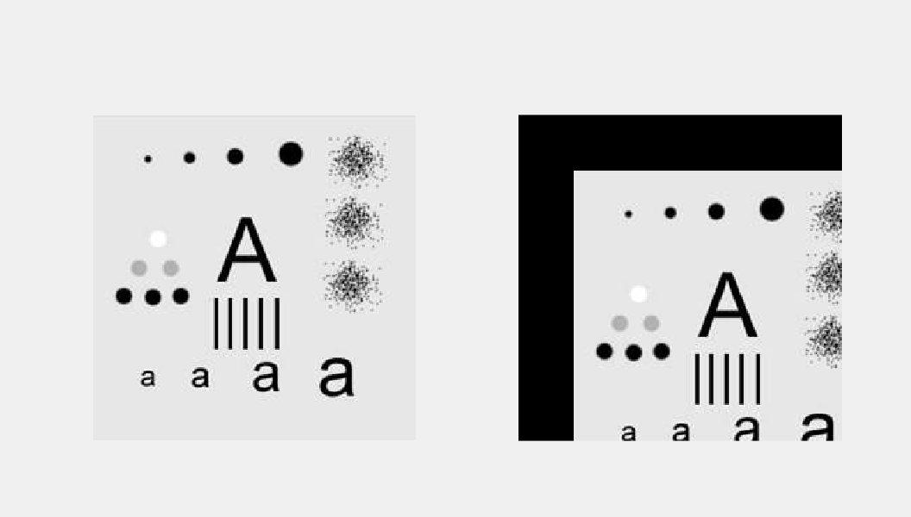

### 1.2 图像的旋转
#### 1.2.1 实验原理
图像绕中心点旋转，假设旋转前坐标为$(x_0,y_0)$，旋转后坐标为$(x_1,y_1)$，旋转角度为$\theta$，则有
$$
  \begin{vmatrix}
 x_1\\
 y_1\\
 1\\
 \end{vmatrix} =
 \begin{vmatrix}
 cos(\theta)&-sin(\theta)&0\\
 sin(\theta)&cos(\theta)&0\\
 0&0&1\\
 \end{vmatrix}
  \begin{vmatrix}
 x_0\\
 y_0\\
 1\\
 \end{vmatrix}
 $$
若绕指定点$(a,b)$旋转，则有
$$
  \begin{vmatrix}
 x_1\\
 y_1\\
 1\\
 \end{vmatrix} =
  \begin{vmatrix}
 1&0&a\\
 0&1&b\\
 0&0&1\\
 \end{vmatrix}
 \begin{vmatrix}
 cos(\theta)&-sin(\theta)&0\\
 sin(\theta)&cos(\theta)&0\\
 0&0&1\\
 \end{vmatrix}
 \begin{vmatrix}
 1&0&-a\\
 0&1&-b\\
 0&0&1\\
 \end{vmatrix}
  \begin{vmatrix}
 x_0\\
 y_0\\
 1\\
 \end{vmatrix}
 $$
- 最近邻插值：取像素点$(x_1,y_1)$周围四个临点中距离该点最近的像素点灰度作为当前像素点的灰度。

- 双线性插值法：利用四个邻点的灰度在两个方向上做线性内插。即，四个邻点构成一个正方形，设坐标从左到右，从下到上依次为$A(x_0,y_0)$,$B(x_0+1,y_0)$, $C(x_0,y_0+1)$,$D(x_0+1,y_0+1)$，则$$g(E) =  (g(B)- g(A))*(x_1 - x_0) + g(A)$$ $$g(F) =  (g(D)- g(C))*(x_1 - x_0) + g(C)$$ $$g(x_1,y_1) =  (y_1- y_0)*(g(F) - g(E)) + g(E)$$

**具体操作**：
根据变换后的像素点$(x_1,y_1)$，求取原图像中对应的点，再根据最近邻插值法和双线性插值法，找到像素点$(x_0,y_0)$。
```matlab
% 最近邻插值
for x = 1 : newl
    for y = 1 : neww
        p = [x; y; 1];
        p = matrix \ p;
        new_x = round(p(1,1));
        new_y = round(p(2,1));
        if(new_x>=1) && (new_x <= length) && (new_y >= 1) && (new_y <= width)
            for k = 1 : h
                out_image_1(x, y, k) = img(new_x, new_y, k);
            end
        end
    end
end
% 双线性插值法
for x = 1 : newl
     for y = 1 : neww
        p = [x; y; 1];
        p = matrix \ p;
        x1 = floor(p(1,1));
        y1 = floor(p(2,1));
        dx = p(1,1) - x1;
        dy = p(2,1) - y1;
        if(p(1,1)>=0) && (p(1,1) <= length) && (p(2,1) >= 0) && (p(2,1) <= width)
            x3 = x1 + 1;
            y3 = y1 + 1;
            if(x1 >= length)
                x3 = length;
            end
            if(y1 >= width)
                y3 = width;
            end
            if(x1 == 0)
                x1 = 1;
            end
            if(y1 == 0)
                y1 = 1;
            end
            for k = 1 : h
                Q1 = img(x1, y1, k);
                Q2 = img(x1, y3, k);
                Q3 = img(x3, y1, k);
                Q4 = img(x3, y3, k);
                val = Q1 * (1-dx) * (1-dy) + Q2 * (1-dx) * dy + Q3 * dx * (1-dy) + Q4 * dx * dy;
                out_image_2(x, y, k) = val;
            end
        end
     end
end

```
 #### 1.2.2 实验结果
 根据坐标变换的公式，假如旋转角度为60度，效果如下，(左侧为最近邻插值，右侧为双线性插值法效果)
 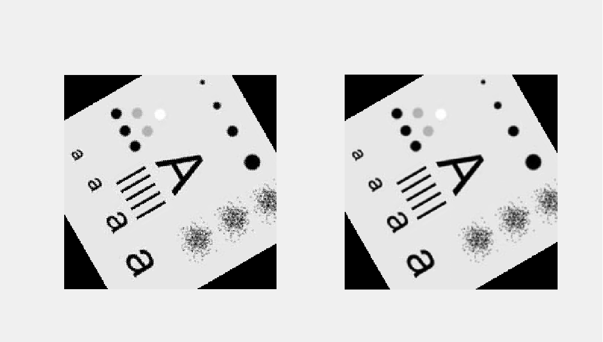

### 1.3 图像的缩放
#### 1.3.1 实验原理

假设图像`x`轴方向的缩放比率为`c`,`y`轴方向缩放比率为`d`，原图像中像素点$(x_0,y_0)$，变换后的像素点为$(x_1,y_1)$，转换矩阵为：
$$
  \begin{vmatrix}
 x_1\\
 y_1\\
 1\\
 \end{vmatrix}=
 \begin{vmatrix}
 c&0&0\\
 0&d&0\\
 0&0&1\\
 \end{vmatrix}
  \begin{vmatrix}
 x_0\\
 y_0\\
 1\\
 \end{vmatrix}
$$

#### 1.3.2 实验结果
`y`轴方向缩放`2`倍，`x`轴方向缩放`0.8`倍，效果如下，(左侧为最近邻插值，右侧为双线性插值法效果)
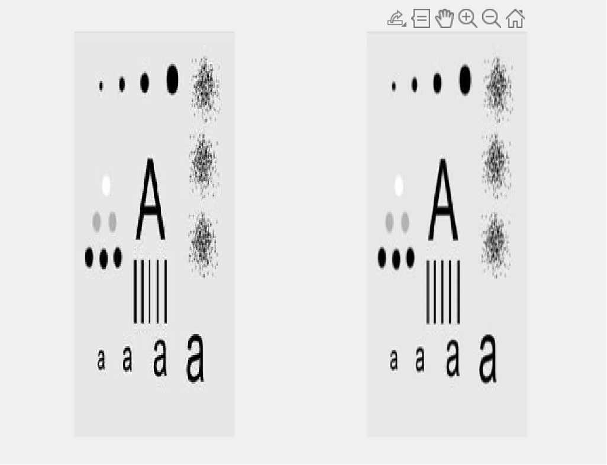

### 1.4 图像几何失真校正
#### 1.4.1 实验原理
按双线性失真校正的方式，选`n=5`对控制点，
 $$
 \begin{cases}
x' = a_1xy+a_2x+a_3y+a_4 \\
y' = b_1xy+b_2x+b_3y+b_4 \\
 \end{cases} （1）
 $$
则
$$M=
 \begin{vmatrix}
 x_1y_1&x_1&y_1&1\\
 x_2y_2&x_2&y_2&1\\
 x_3y_3&x_3&y_3&1\\
 x_5y_4&x_4&y_4&1\\
 x_5y_5&x_5&y_5&1\\
 \end{vmatrix}
$$
$$
  \begin{vmatrix}
 a_1\\
 a_2\\
 a_3\\
 a_4\\
 \end{vmatrix} = (M^TM)^{-1}M^T  \begin{vmatrix}
 x_1\\
 x_2\\
 x_3\\
 x_4\\
 x_5\\
 \end{vmatrix}
$$
$$
  \begin{vmatrix}
 b_1\\
 b_2\\
 b_3\\
 b_4\\
 \end{vmatrix} = (M^TM)^{-1}M^T  \begin{vmatrix}
 y_1\\
 y_2\\
 y_3\\
 y_4\\
 y_5\\
 \end{vmatrix}
$$

则根据$(M^TM)^{-1}M^T$矩阵可以计算系数，则根据`(1)`式中的等式，选取图像中的像素点$(i,j)$，通过公式$$\begin{vmatrix}
 i*j&i&j&1\\
 \end{vmatrix}\begin{vmatrix}
 a_1\\
 a_2\\
 a_3\\
 a_4\\
 \end{vmatrix} $$
计算变换后的像素点。
#### 1.4.2 实验结果
使`用[x, y] = ginput(10)`函数来选取对应的点。
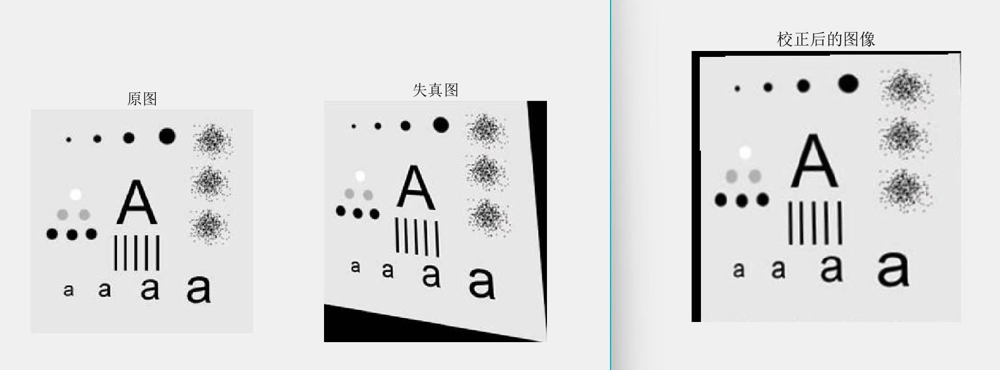

## 实验二 图像点处理增强
### 2.1 灰度的线性变换
#### 2.1.1 实验原理
对于像素点的灰度值进行线性变换，设置线性函数的斜率$f_A$，在`y`轴上的截距为$f_B$，灰度为$i$，变换后的灰度为$f(i)$，则有$$f(i) = f_A*i+f_B$$

#### 2.1.2 实验效果
设置斜率为`2`，截距为`20`，图像灰度值变大，图像变白变亮。
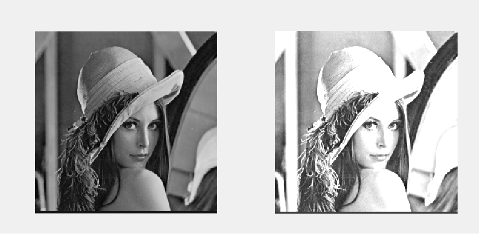

### 2.2 灰度拉伸
#### 2.2.1 实验原理
灰度变换的分段变换
$$
 \begin{cases}
f(x) = \frac{y_1}{x_1}x & x < x_1 \\
f(x) = \frac{y_2 - y_1}{x_2 - x_1}(x-x_1) + y_1    &x_1<=x <= x_2\\
f(x) = \frac{255 - y_2}{255 - x_2}(x-x_2) + y_2 &  x > x_2\\
\end{cases}
 $$

#### 2.2.2 实验结果
设置$x_1= 20$，$y_1= 29$，$x_2= 250$，$y_2= 250$
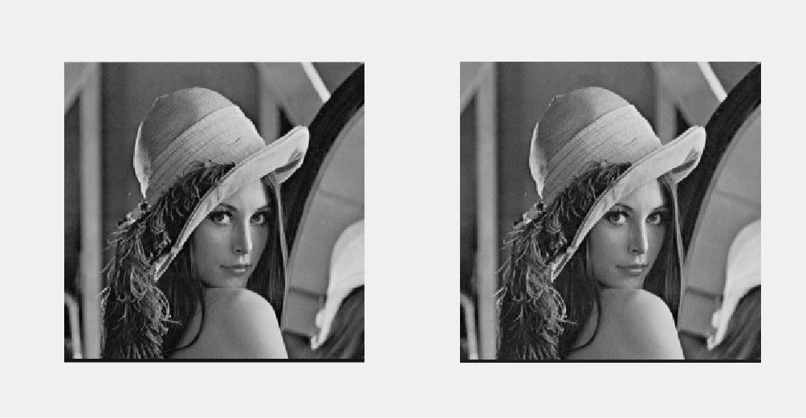

### 2.3 灰度直方图
#### 2.3.1 实验原理
灰度直方图是灰度值的函数，描述的是图像中具有该灰度值的像素的个数，其横坐标表示像素的灰度级别，纵坐标表示该灰度出现的频率(象素的个数)
则根据`histogram()`函数来获取直方图。
```matlab
histogram(img,'BinLimits',[min, max]);
```
#### 2.3.2 实验结果
设置上限为250，下限为50
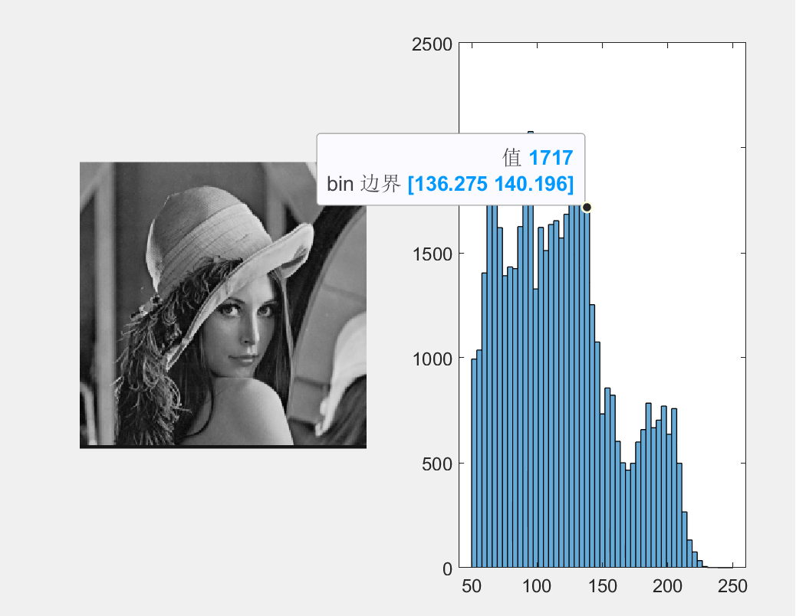

### 2.4 直方图均衡
#### 2.4.1 实验原理 
**直方图均衡**：将图像的直方图变换为均匀分布的形式。
**直方图规定化**：将图像的直方图变换为指定分布的形式。
```matlab
% 直方图均衡增强
img_S = histeq(img);
subplot(3,2,3); imshow(img_S); title("增强后图像");
subplot(3,2,4); histogram(img_S); title("增强后直方图");

% 直方图规定化处理
% normpdf正态概率密度函数
img_G = histeq(img, normpdf((0:1:255), 127, 70));
```
#### 2.4.2 实验结果
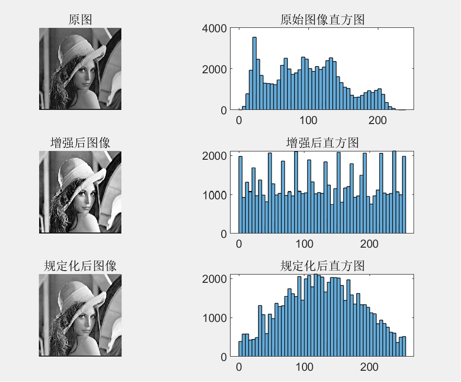

## 实验三 图像空间域滤波增强
### 3.1 加噪
#### 3.1.1 实验原理
**椒盐噪声**：受噪声干扰的图像像素以50%的概率等于图像灰度的最大或最小的可能取值。
**高斯噪声**：噪声的概率密度函数服从高斯分布
**随机值脉冲噪声**：随机选取噪声值。
#### 3.1.2 代码
```matlab
% 添加椒盐噪声
img_sp =imnoise(img,'salt & pepper', 0.03);

% 添加高斯噪声,默认方差为0.01
img_gs =imnoise(img,'gaussian');

function [img_random] = rdm_noise(img)
    % 设置3%的随机值脉冲噪声干扰
    % 通过椒盐噪声找点
    img_sp =imnoise(img,'salt & pepper', 0.03);
    diff = img_sp ~= img;
    % disp(diff);
    [r,l] = size(img);
    img_random = img;
    for i = 1 : r
        for j = 1 : l
            if(diff(i,j) == 1)
                img_random(i,j) = randi(256) - 1;
            end
        end
    end
end
```

### 3.2 使用均值滤波器去除图像中的噪声
#### 3.2.1 实验原理
对于一个窗口，对窗口中的像素点的灰度平均值，该窗口中心点的灰度值则变换成灰度平均值。
$$f(x_0,y_0) = \frac{1}{N * N}\sum{f(x,y)}$$
```matlab
% 均值滤波
function [filter_img] = mean_filter(img)
    [r,l] = size(img);
    filter_img = img;
    for i = 2 : r - 1
        for j = 2 : l - 1
            filter_img(i,j) = mean(mean(img(i-1:i+1,j-1:j+1)));
        end
    end
end
```
#### 3.2.2 实验结果
3 x 3 窗口
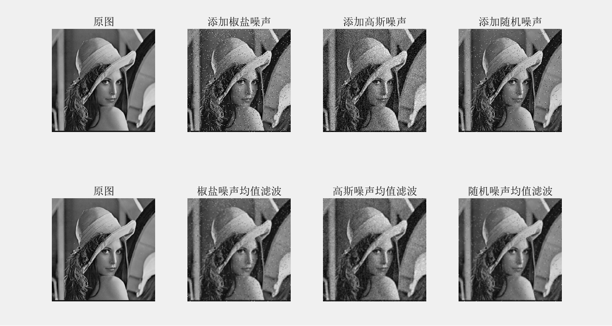

### 3.3 使用超限邻域平均值去除图像中的噪声
#### 3.3.1 实验原理
对于窗口内像素点的灰度平均值，若与窗口中心点相差大于阈值`T`，则该点灰度值为均值，否则不变。
$$ g(i,j) =  
 \begin{cases}
\frac{1}{N * N}\sum{f(x,y)} & |f(i,j) - \frac{1}{N * N}\sum{f(x,y)}| > T \\ 
f(i,j) &其他\\
\end{cases}
 $$
#### 3.3.2 实验结果
设置阈值为35
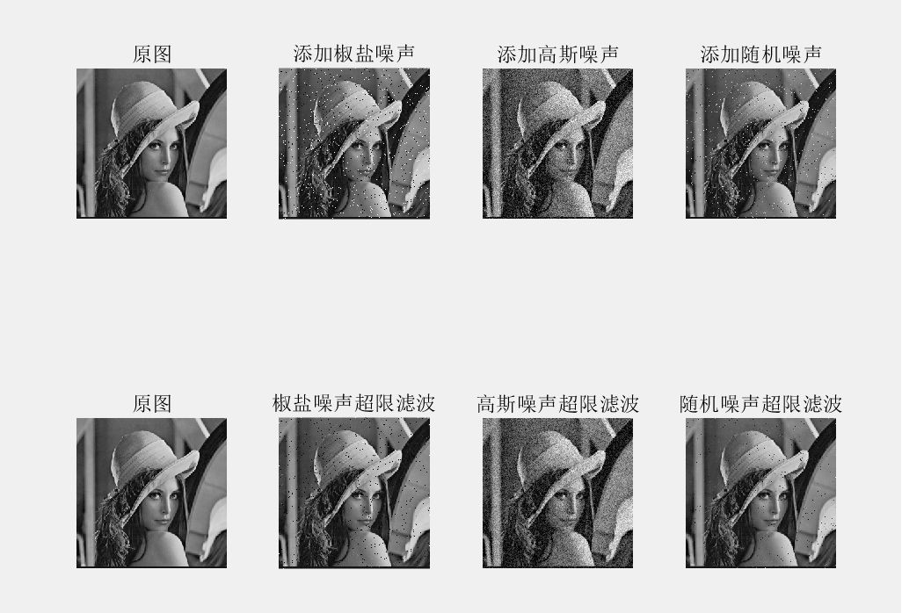

### 3.4 用中值滤波器去除图像中的噪声
#### 3.4.1 实验原理
使用窗口中像素点灰度平均值替代窗口中心点灰度值。
$$f(x_0,y_0) = Med\{f(x,y)| x \in [x_0 - N, x_0 +N], y \in [y_0-N,y_0+N]\} $$
#### 3.4.2 实验结果
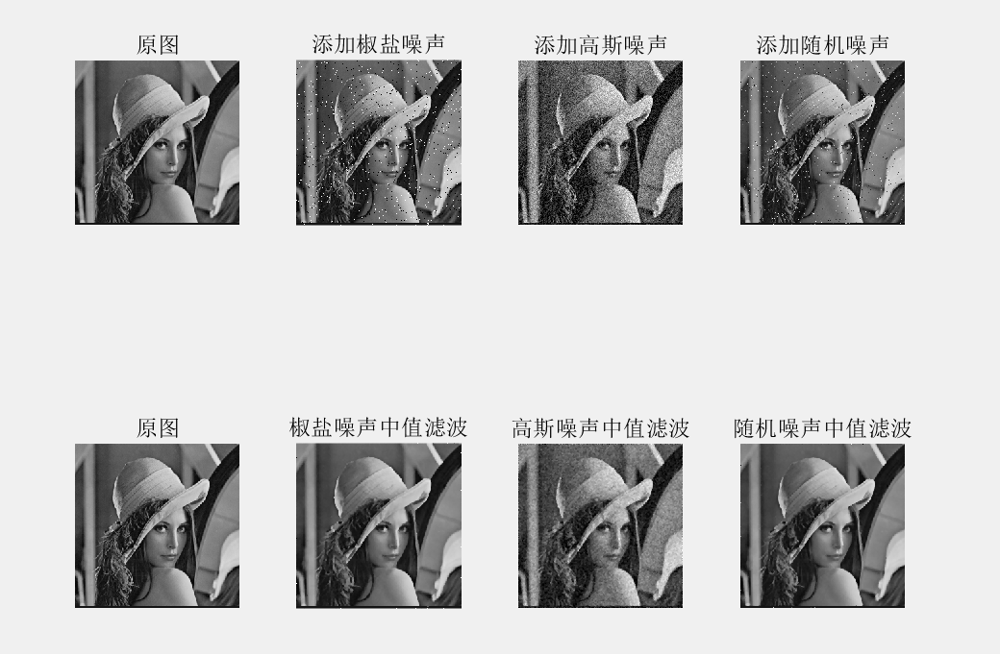
### 3.5 用超限中值滤波器去除图像中的噪声
#### 3.5.1 实验原理
用超限中值滤波器去除图像中的噪声：当某个像素的灰度值超过窗口中像素灰度值排序中间的那个值，且达到一定水平时，则判断该点为噪声，用灰度值排序中间的那个值来代替；否则还是保持原来的灰度值

#### 3.5.2 实验结果
设置阈值为35
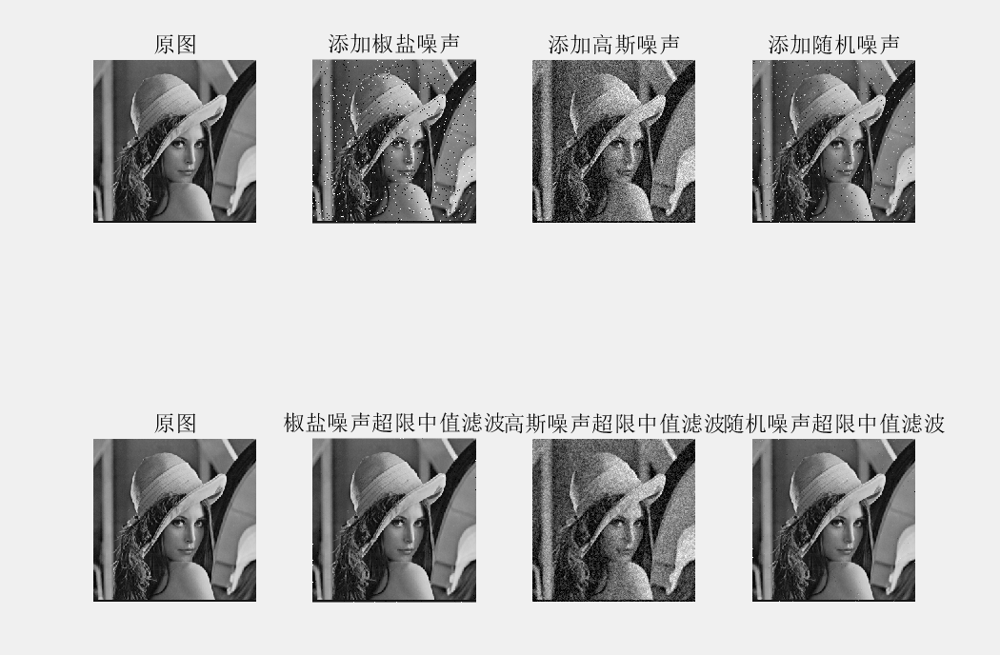

### 分析结果
- 四种处理结果中，超限均值滤波的效果好于均值滤波，超限中值滤波的效果好于中值滤波

- 对于椒盐噪声和随机噪声图像，中值滤波和超限中值滤波处理效果更好

- 对高斯噪声，均值滤波和超限均值滤波效果更好，中值滤波处理图像较模糊

- 相对于中值滤波方式，均值滤波方式结果更平滑，中值滤波方式滤波后噪声点更明显，但其余图像更清晰，边缘保留更好。

### 3.6 利用常用的边缘检测算子提取图像边缘
#### 3.6.1 实验原理
**Roberts算子**：$$G[F(x,y)] \approx |F(x,y) - F(x+1,y+1)| + |F(x+1,y) - F(x,y+1)|$$
**Sobel算子**：图像中的每个点都用下面的两个模板做卷积，一个对通常的垂直边缘响应最大，另一
个对水平边缘响应最大，两个卷积的最大值作为该点的输出位。
 $$
 \begin{Bmatrix}
 -1&-2&-1\\
 0&0&0\\
 1&2&1\\
 \end{Bmatrix}
 $$
  $$
 \begin{Bmatrix}
 -1&0&1\\
 -2&0&2\\
 -1&0&1\\
 \end{Bmatrix}
 $$
**Prewitt算子**：
图像中的每个点都用下面的两个模板做卷积，两个卷积的最大值作为该点的输出位。
 $$
 \begin{Bmatrix}
 -1&-1&-1\\
 0&0&0\\
 1&1&1\\
 \end{Bmatrix}
 $$
  $$
 \begin{Bmatrix}
 1&0&-1\\
 1&0&-1\\
 1&0&-1\\
 \end{Bmatrix}
 $$
**Laplace算子**：
分别用模板
 $$
 \begin{Bmatrix}
 0&1&0\\
 1&-4&1\\
 0&1&0\\
 \end{Bmatrix}
 $$
  $$
 \begin{Bmatrix}
 -1&-1&-1\\
 -1& 8 &-1\\
 -1& -1 &-1\\
 \end{Bmatrix}
 $$

**Canny算子**
流程为
(a) 用高斯滤波器平滑图像;
(b) 用一阶偏导的有限差分来计算梯度的幅值和方向;
(c) 对梯度幅值进行非极大值抑制;
(d) 用双间值算法检测和连接边缘

直接采用函数
```matlab
Roberts = edge(img,'Roberts');

%Sobel算子
Sobel = edge(img,'Sobel');

%Prewitt算子
Prewitt = edge(img,'Prewitt');

%拉普拉斯算子
Laplacian1 = imfilter(img, [0 1 0; 1 -4 1; 0 1 0]);
Laplacian2 = imfilter(img,[-1 -1 -1; -1 8 -1; -1 -1 -1]);
%Canny算子
Canny = edge(img,'Canny');
```

#### 3.6.2 实验结果
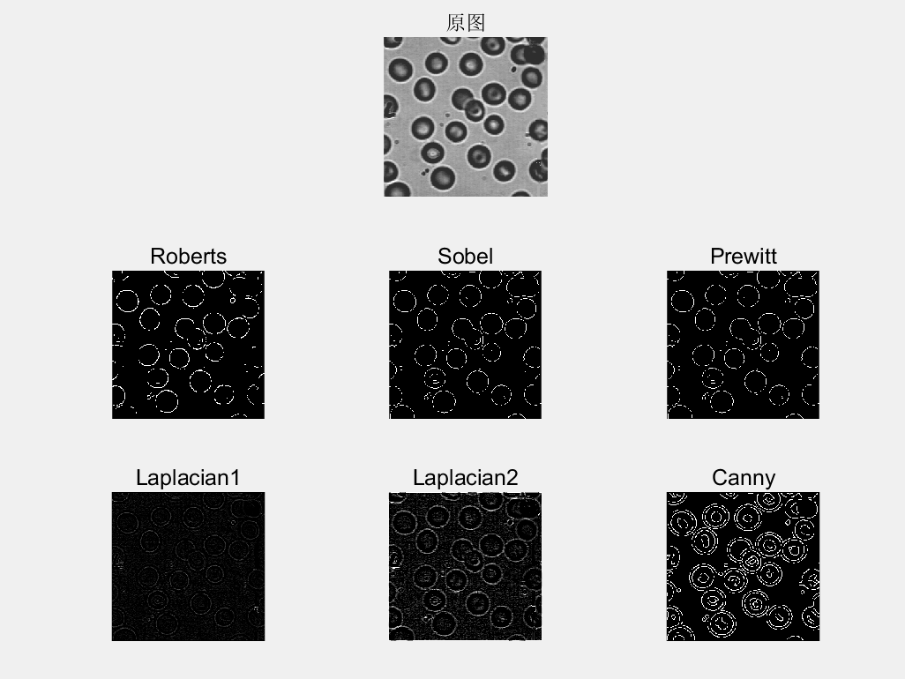

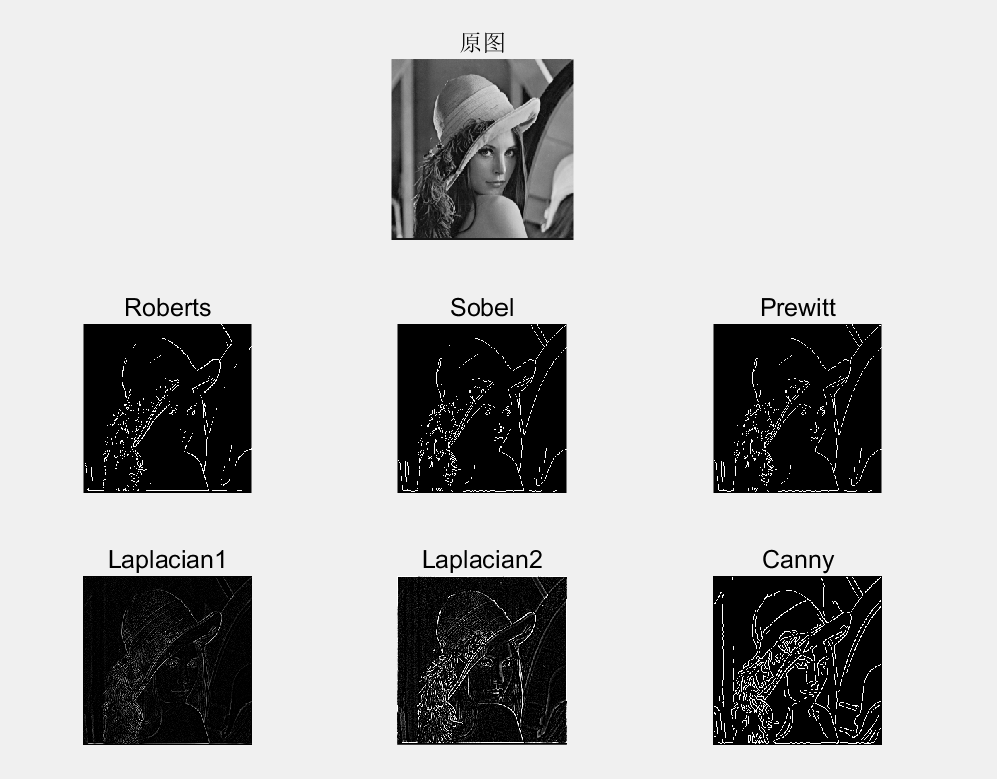

**效果比较**
- 使用`Canny`算子细节更多，其次是第二种拉普拉斯算子。

## 实验四 图像变换及频域滤波增强
### 4.1 傅里叶变换
#### 4.1.1 实验原理
- 使用`fft2`函数进行傅里叶变换
- 使用`iff2`函数进行傅里叶反变换
- 使用`angle`函数获取相位
- 使用`abs`函数取模
```matlab
% 进行二维傅里叶变换
fft_img_1 = fft2(img);
% 对幅度做变换
% 将低频移到中心点
shift_img_1 = fftshift(fft_img_1);
LF_img1 = log(abs(shift_img_1) + 1); %取模
% 幅度反变换
ifft_img_1 = ifft2(abs(fft_img_1)); % abs求复数的模
% 相位反变换 angle
ifft_angle_1 = ifft2(10000 * exp(1i * angle(fft_img_1)));
```
#### 4.1.2 实验效果
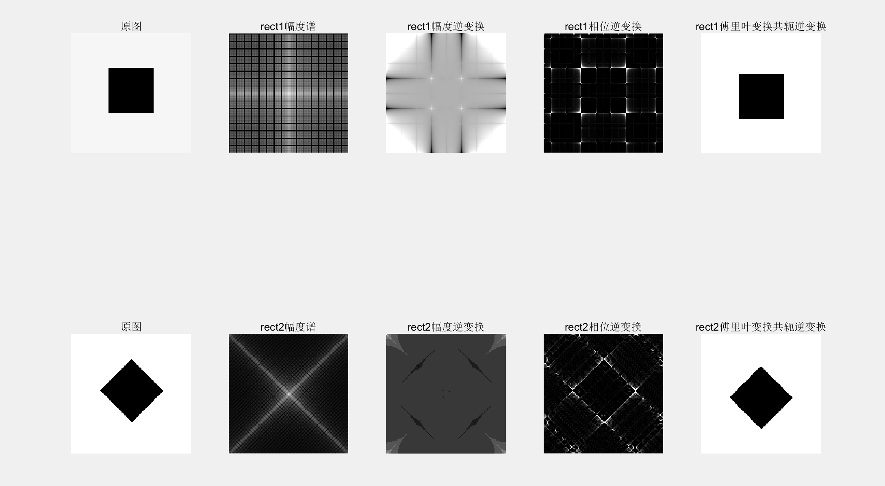

- 根据幅度和相位进行 Fourier 反变换的结果可知，幅频特性包含了图像亮度的分布，相频特性可以看出图像的边缘，人眼对边缘变化更敏感，从而人眼对相频特性比幅频特性敏感。
- 将图像的傅里叶变化共轭后反变换，与原始图像相比，旋转了180度。

### 4.2 低通滤波
#### 4.2.1 实验原理
低通滤波表示为$$G(u,v)=F(u,v)H(u,v)$$
- 理想低通滤波器，当`(u,v)`到原点的距离小于截止频率，则保留该点，否则变为0.

$$ H(u,v) =  
 \begin{cases}
1 & D(u,v) <= D_0 \\
0 & D(u,v) > D_0 \\
\end{cases}
 $$
- 巴特沃斯低通滤波器
$$ H(u,v) =  \frac{1}{1+(\frac{D(u,v)}{D_0})^{2n}}$$

- 高斯低通滤波器
$$ H(u,v) =  e^{-D^2(u,v)/(D_0)^2} $$
#### 4.2.2 实验结果
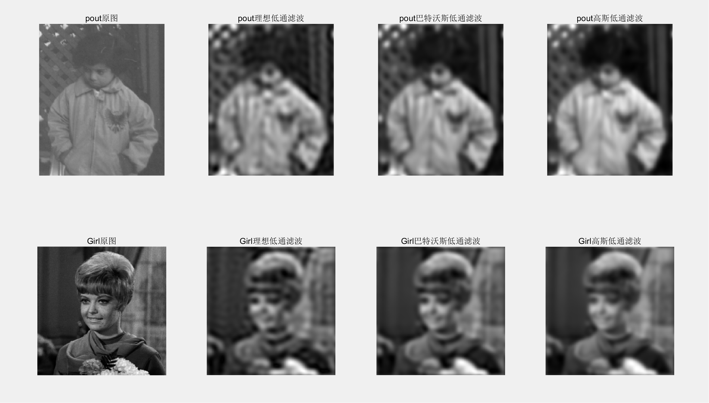
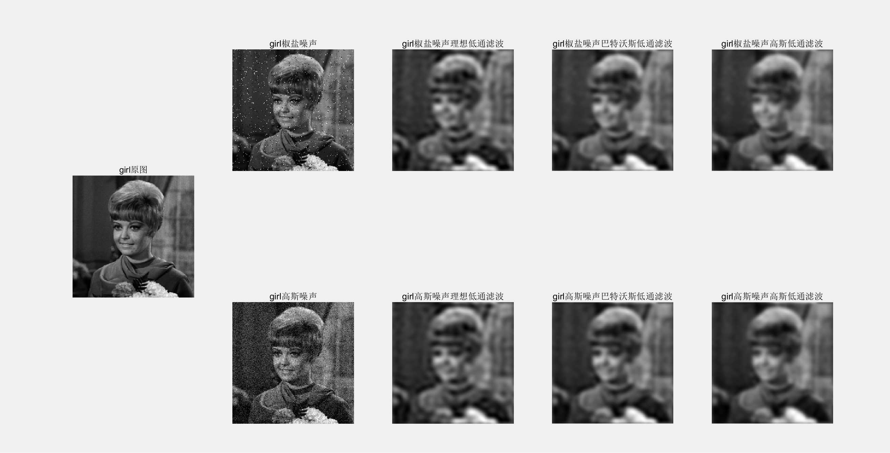

**结果**：
- 截至频率越低，图像更平滑，但信息保留更少。理想低通滤波的振铃效应最明显
- 高斯低通滤波器对加高斯噪声的图像去噪效果更好，理想低通滤波器的去噪效果最差，振铃效果更明显
### 4.3 高通滤波
#### 4.3.1 实验原理
高通滤波表示为$$G(u,v)=F(u,v)H(u,v)$$
- 理想低通滤波器，当`(u,v)`到原点的距离大于截止频率，则保留该点，否则变为0.
$$ H(u,v) =  
 \begin{cases}
1 & D(u,v) > D_0 \\
0 & D(u,v) <= D_0 \\
\end{cases}
 $$
- 巴特沃斯低通滤波器
$$ H(u,v) =  \frac{1}{1+(\frac{D_0}{D(u,v)})^{2n}}$$

- 高斯低通滤波器
$$ H(u,v) =  e^{-(D_0)^2/D^2(u,v)} $$
#### 4.3.2 实验结果
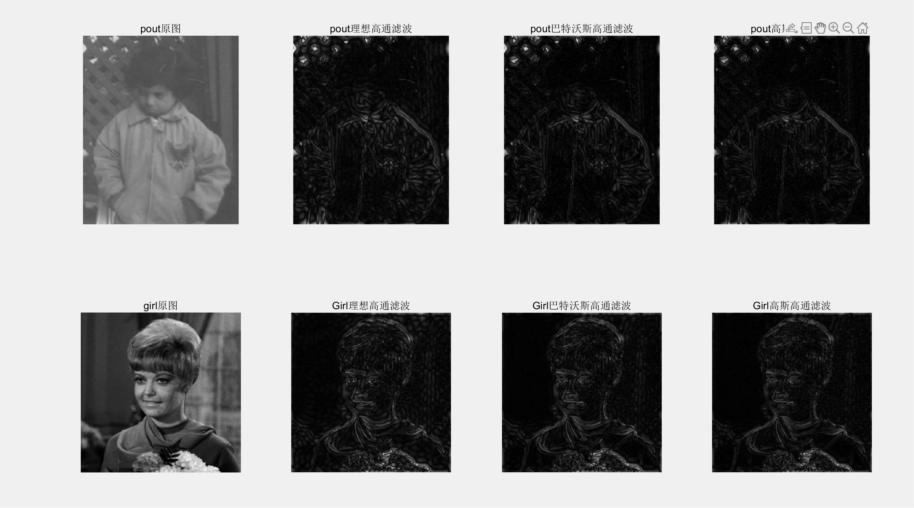

**结果**
- 截止频率越低，与原图像相比，保留的细节越多，反之，保留的细节越细。理想高通滤波的振铃效果较明显。

### 4.4 高频增强滤波
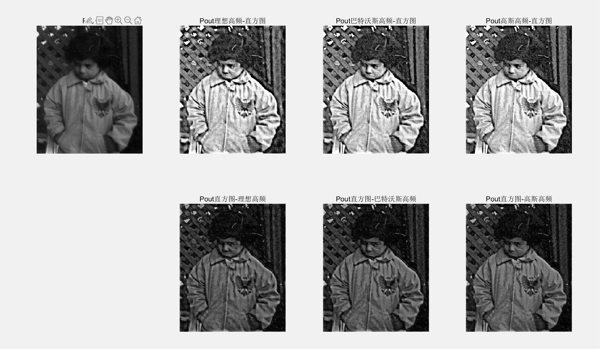

**结果**
先进行高频增强滤波，再进行直方图增强的效果更好，因为在直方图均衡的过程中会改变图像的灰度值分布，丢失图像信息。
## 实验五 图像恢复与图像分割

### 5.1 逆滤波和维纳滤波恢复图像
#### 5.1.1 实验原理
- 采用`deconvwnr`函数进行逆滤波处理
- 采用`fspecial`函数和`imfilter`函数进行运动模糊
- 当没有噪声时，逆滤波和维纳滤波恢复效果相同
- 有噪声时，将噪信比指定为高斯噪声与图像的方差比，从而进行维纳滤波恢复
```matlab
img = imread('./image/flower1.jpg');
% 位移30个像素，角度为45度
psf = fspecial('motion',30,45);

% 产生运动模糊
motion = imfilter(img, psf, 'conv', 'circular');
% 产生高斯噪声
img_gauss = imnoise(motion, 'gaussian', 0, 0.001);

% 逆滤波恢复
inv_img = deconvwnr(motion, psf, 0);

% 维纳滤波恢复
wn_inv = deconvwnr(motion, psf);
```
#### 5.1.2 实验结果
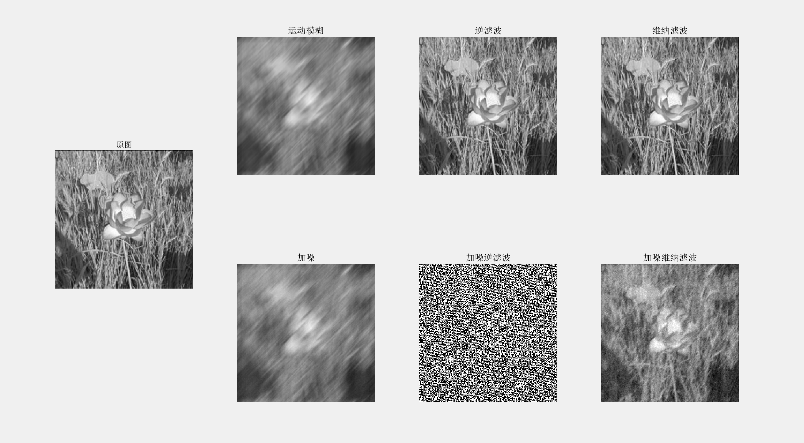

**结果**
在加噪运动模糊图像中，进行逆滤波时高频的高斯噪声会被放大，从而无法恢复，在进行维纳滤波时可以抑制噪声得到较好的结果。
### 5.2 OTSU
#### 5.2.1 实验原理
1) 统计灰度级中每个像素在整幅图像中的个数。
2) 计算每个像素在整幅图像的概率分布。
3) 对灰度级进行遍历搜索，计算当前灰度值下前景背景类间概率。
4) 通过目标函数计算出类内与类间方差下对应的阈值。
```matlab
function [T] = OTSU(img)
    [r, l] = size(img);
    N = r * l;
    g = zeros(256,1);  
    p = zeros(256, 1);
    % 计算概率
    for i = 0 : 255
        p(i+1) = length(find(img == i)) / N;
    end
    mu = sum((0:255)' .* p);  % 总的平均灰度
    w0 = 0;
    u0 = 0;
    for i = 0 : 255
        w0 = w0 + p(i+1); % 计算概率
        if w0 == 0 || w0 == 1
            g(i+1) = 0;
            continue;
        end

        w1 = 1 - w0;
        u0 = u0 + i * p(i+1);
        u1 = (mu - u0) / w1;
        g(i+1) = w0 * w1 * ((u0 / w0 - u1).^2);
    end
    [~, T] = max(g);
    T = T - 1;
end
```
#### 5.2.2 实验结果
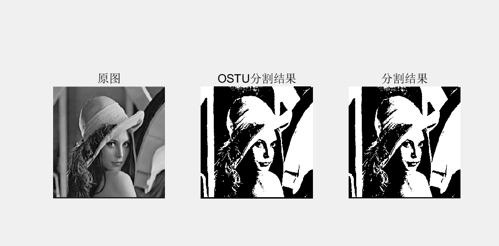
### 5.3 四叉树
#### 5.2.1 实验原理
- 通过`qtdecomp`函数进行分割，对于极差大于阈值的块进行分裂，设置最小块为`2x2`，代码为`tree = qtdecomp(img,threshold,2)`
- 对分裂块进行重新赋值，从而标记不同块
- 将极差较小的块合并
```matlab
%将极差较小的块的标记合并
for j = 1 : i
    % 找出块 j 的边界像素且这些边界像素邻接的其他块编号
    % 既是边界临界像素也是区域外像素，则找到了边界
    bound = boundarymask(blocks==j,4) & (~(blocks==j));
    [r,l] = find(bound==1); % 找到这些边界像素的坐标
    for k = 1 : size(r,1)
        % 合并
        merge = img((blocks==j) | (blocks==blocks(r(k),l(k))));
        % 计算合并后块的极差
        if(range(merge(:))<threshold*256)
            blocks(blocks==blocks(r(k),l(k))) = j;
        end
    end
end
```
#### 5.2.2 实验结果
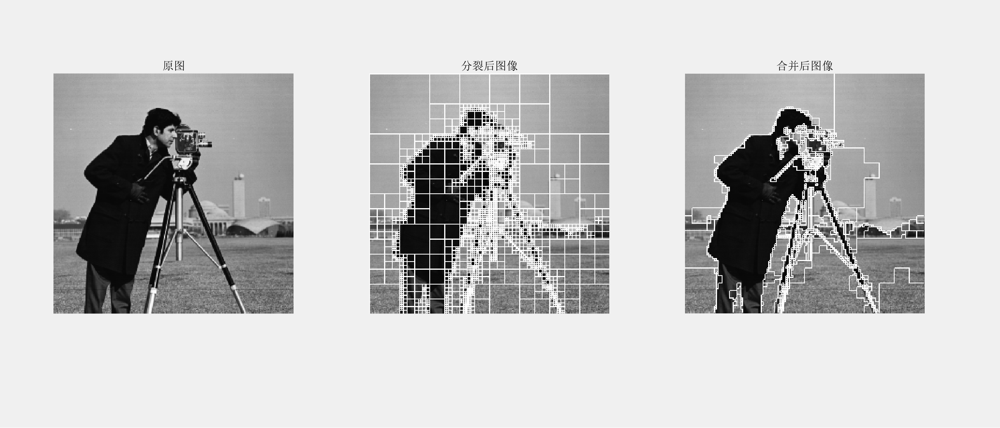