# LAB REPORT 
## 0 实验基本信息
#### 小组成员：
- PB22111639 马筱雅
- PB22111644 姬子琢
#### 代码结构
- `XGBoost.ipynb`：使用`XGBoost`模型进行预测的代码
- `XGBoost.log`：使用`XGBoost`模型进行预测过程的`log`记录，包含不同优化方式的结果。
- `XGB-LIGHT.ipynb`：使用`XGBoost`模型和`LightGBM`模型进行预测的代码
- `XGB-LIGHT.log`：使用`XGBoost`模型和`LightGBM`模型进行预测的`log`记录
- `data—analysis.ipynb`：对数据进行分析和绘图的代码
注：由于最开始没有生成log文件，所以log文件为后续复现结果

## 1 问题描述
实验项目：`child-mind-institute-problematic-internet-use`
随着互联网的推广，青少年沉迷网络问题日渐严重，本实验目的在于预测青少年互联网沉迷程度。实验给出一部分青少年性别、年龄、身体状况等基本信息，并给出沉迷结果，要求根据已知数据，训练模型，从而对其余青少年的沉迷问题进行分类预测。

**本实验说明**：使用两种方式，单模型和集成学习，两种方式之间较为独立，由两个人分别完成。

## 2 数据分析
### 2.1 数据集
数据主要分为测试集`train.csv`和训练集`test.csv`，以及部分青少年佩戴仪器的情况，该部分数据以`.parquet`的形式呈现。

- `train.csv`： 该部分数据包含`82`个属性，主要关于10个方面。
  - `Demographics（性别、年龄等`）
  - `Internet Use（每天的互联网使用情况`）
  - `Children's Global Assessment Scale（评估量表的数据）`
  - `Physical Measures（身高等身体数据）`
  - `FitnessGram Vitals and Treadmill（NHANES心血管健康）`
  - `FitnessGram Child（体能评估）`
  - `Bio-electric Impedance Analysis（身体成分评估）`，
  - `Physical Activity Questionnaire（活动信息）`，
  - `Sleep Disturbance Scale（睡眠评估）`，
  - `Actigraphy（体力活动测量）`，
  - `Parent-Child Internet Addiction Test（网瘾测评）`
- `test.csv`：与`train.csv`相比，缺失了`Parent-Child Internet Addiction Test（网瘾测评）`的部分，该部分所有的属性值之和用来评估最终的沉迷结果。
- `.parquet`，包含佩戴加速度计的基本信息。

在`train.csv`和`test.csv`中，除了用户`id`，只有有关`Season`属性的值是字符串类型，其余均是`int`或者`float`等数字类型。

### 2.2 数据分布

首先，定义固有属性，包括参与季节，用户年龄，性别。这些属性不随着测评过程而改变，是本身就存在的，观测其分布。

- **性别分布**
<p align = 'center'>
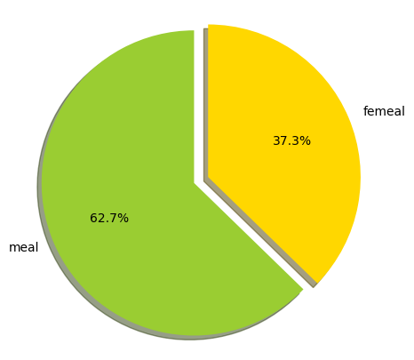
</p>

- **年龄分布**
  <p align = 'center'>
  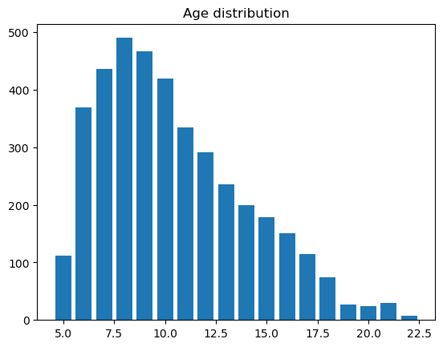
  </p>

- **结果分布**
  <p align = 'center'>
  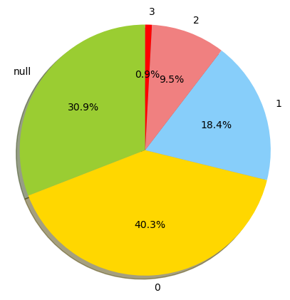
  </p>
可以看出数据结果分布不均衡，最终可能导致训练结果更偏向于`0`和`1`。

- **季节分布**
  <p align = 'center'>
  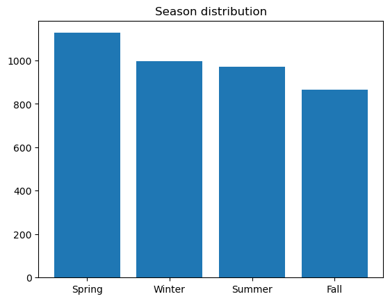
  </p>

- **季节和`sii`的关系**
  <p align = 'center'>
  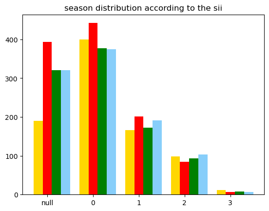
  </p>

对每个属性值进行季节分布的分析，在确定数据值的分布中，不同季节之间的分布没有明显差异，分析其缺失比例如下，不同的测评阶段的季节数据缺失值不同，初步判断季节因素影响不大。
```
Basic_Demos-Enroll_Season    0.000000
CGAS-Season                  0.354798
Physical-Season              0.164141
Fitness_Endurance-Season     0.669697
FGC-Season                   0.155051
BIA-Season                   0.458333
PAQ_A-Season                 0.880051
PAQ_C-Season                 0.565404
PCIAT-Season                 0.309091
SDS-Season                   0.338889
PreInt_EduHx-Season          0.106061
dtype: float64
```
- **缺失数据分布**
  - **所有数据中缺失数量分布**
  <p align = 'center'>
  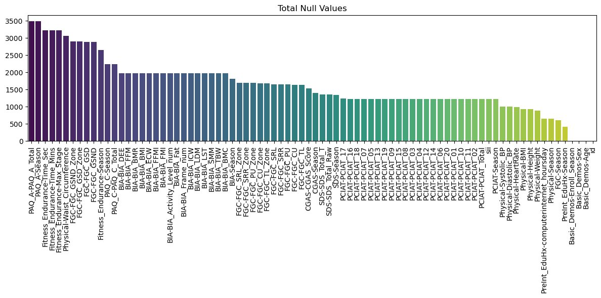
  </p>

  - **在`sii`不为null中的缺失数据分布**
  <p align = 'center'>
  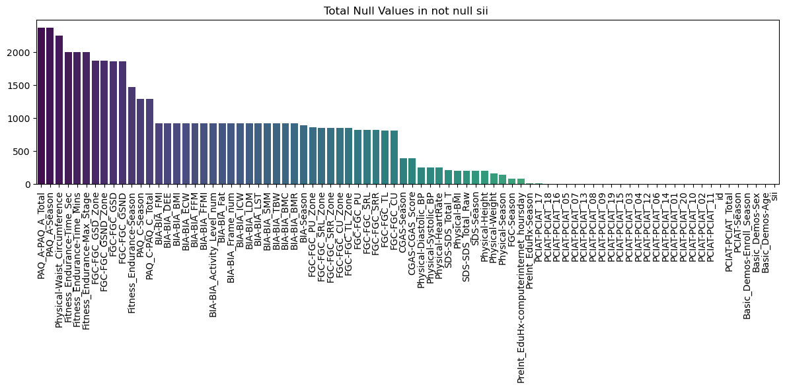
  </p>

综上，在分布上，性别数量，年龄数量有区别，季节分布差别不大，因此暂时考虑舍弃季节数据。对于缺失值中缺失过多的数据，考虑进行舍弃，对于缺失数据，进行填充。

### 2.3 分析parquet数据
- `parquet`数据包含加速度计的加速度，光感，电量，测量时间等数据。
- 不是所有的`train.csv`中的数据均有对应的`parquet`数据


## 3 特征工程
  
### 3.1 单模型构造特征
主要思路如下
 - 对于缺失值中缺失过多的数据，舍弃
 - 舍弃季节数据
 - 对于直观相关的数据，如果大致正相关则相乘，负相关则相除，从而构建联系，并使得不同数据之间有差别。

在此部分仅说明了构造特征，对于特征工程之前数据的处理，见**4.2.1**节

```python
def feature_engineering(df):
    # 为不同属性建立关联，
    '''
    height和age有关，waist与age有关
    BIA_BIA_BMI
    BIA_BIA_BMR 基础代谢率
    BIA_BIA_DEE 日常能量消耗
    BIA_BIA_ECW 细胞外水？
    BIA_BIA_FFM 无脂肪质量
    BIA_BIA_FFMI 无脂质量指数
    BIA_BIA_FMI 脂肪质量指数
    BIA_BIA_Fat 体脂百分比
    BIA_BIA_Frame_num 
    BIA_BIA_ICW 细胞内水
    BIA_BIA_LDM 瘦干质量
    BIA_BIA_LST 瘦软组织
    BIA_BIA_SMM 骨骼肌肉质量
    BIA_BIA_TBW 身体水分含量
    BIA-BIA_Activity_Level_num 活动水平
    DEE 和 Activity_Level_num 有关
   BIA_BIA_BMR 和 BIA_BIA_Fat 有关
   BIA_BIA_FMI 和 BIA_BIA_DEE 有关
    '''
    df['Internet_Hours_Age'] = df['PreInt_EduHx-computerinternet_hoursday'] * df['Basic_Demos-Age']
    df['Height-Age'] = df['Basic_Demos-Age'] * df['Physical-Height']
    df['BMI-Age'] = df['Physical-BMI'] * df['Basic_Demos-Age']
    # 体脂越高，基础代谢率可能越低
    df['BMR-Fat'] = df['BIA-BIA_Fat'] / df['BIA-BIA_BMR']
    # DEE 日常能量消耗和重量，FMI有关
    df['DEE_Weight'] = df['BIA-BIA_DEE'] / df['Physical-Weight']
    df['DEE_FMI'] = df['BIA-BIA_DEE'] / df['BIA-BIA_FMI']
    # 身体水分含量和细胞内水有关，和肌肉，成正比
    df['ICW_TBW'] = df['BIA-BIA_ICW'] * df['BIA-BIA_TBW']
    df['SMM_TBW'] = df['BIA-BIA_SMM'] * df['BIA-BIA_TBW']
    '''
    FGC-FGC_GSD 总计握力
    FGC-FGC_PU 总计push up
    FGC-FGC_CU
    '''
    df['GSD-Age']= df['FGC-FGC_GSND'] * df['FGC-FGC_GSD'] * df['Basic_Demos-Age']
    '''
    PreInt_EduHx-computerinternet_hoursday 电脑使用时间
    可能和年龄质量有关
    '''
    df['Time-Age'] = df['Basic_Demos-Age'] * df['PreInt_EduHx-computerinternet_hoursday']
    df['FMI-Time'] = df['BIA-BIA_FMI'] * df['PreInt_EduHx-computerinternet_hoursday']
    # 尝试使用缺失值较少的数据
    df['SMM-Height'] = df['BIA-BIA_SMM'] * df['Physical-Height']
    df['DEE-ACT'] = df['BIA-BIA_DEE'] * df['BIA-BIA_Activity_Level_num']
    return df
```
### 3.2 集成模型构造特征
主要思路如下
- parquet文件里除去step列有12个特征列，把它们的count、mean、std、min、25%、50%、75%、max分别列为一列，共得到96列，根据parquet文件对应的id合并到csv文件得到的dataframe里。
- 去掉train的dataframe里sii值缺失的行。
- 把与季节有关的列中spring、summer、fall、winter和缺失值分别处理为1,2,3,4,5。
- 使train里除了sii列外，只包含test里有的列。
- 构造新的特征列。
  ```python
  def feature_engineering(df):#用于在一个 DataFrame 中创建新的特征列
    
    #加很多新列
    df['BMI_Age'] = df['Physical-BMI'] * df['Basic_Demos-Age']#BMI*年龄
    df['Internet_Hours_Age'] = df['PreInt_EduHx-computerinternet_hoursday'] * df['Basic_Demos-Age']
    df['BMI_Internet_Hours'] = df['Physical-BMI'] * df['PreInt_EduHx-computerinternet_hoursday']
    df['BFP_BMI'] = df['BIA-BIA_Fat'] / df['BIA-BIA_BMI']
    df['FFMI_BFP'] = df['BIA-BIA_FFMI'] / df['BIA-BIA_Fat']
    df['FMI_BFP'] = df['BIA-BIA_FMI'] / df['BIA-BIA_Fat']
    df['LST_TBW'] = df['BIA-BIA_LST'] / df['BIA-BIA_TBW']
    df['BFP_BMR'] = df['BIA-BIA_Fat'] * df['BIA-BIA_BMR']
    df['BFP_DEE'] = df['BIA-BIA_Fat'] * df['BIA-BIA_DEE']
    df['BMR_Weight'] = df['BIA-BIA_BMR'] / df['Physical-Weight']
    df['DEE_Weight'] = df['BIA-BIA_DEE'] / df['Physical-Weight']
    df['SMM_Height'] = df['BIA-BIA_SMM'] / df['Physical-Height']
    df['Muscle_to_Fat'] = df['BIA-BIA_SMM'] / df['BIA-BIA_FMI']
    df['Hydration_Status'] = df['BIA-BIA_TBW'] / df['Physical-Weight']
    df['ICW_TBW'] = df['BIA-BIA_ICW'] / df['BIA-BIA_TBW']
    df['hoursday_Age'] = df['PreInt_EduHx-computerinternet_hoursday'] / df['BMI_Age']

    df['Age_Weight'] = df['Basic_Demos-Age'] * df['Physical-Weight']
    df['Sex_BMI'] = df['Basic_Demos-Sex'] * df['Physical-BMI']
    df['Sex_HeartRate'] = df['Basic_Demos-Sex'] * df['Physical-HeartRate']
    df['Age_WaistCirc'] = df['Basic_Demos-Age'] * df['Physical-Waist_Circumference']
    df['BMI_FitnessMaxStage'] = df['Physical-BMI'] * df['Fitness_Endurance-Max_Stage']
    df['Weight_GripStrengthDominant'] = df['Physical-Weight'] * df['FGC-FGC_GSD']
    df['Weight_GripStrengthNonDominant'] = df['Physical-Weight'] * df['FGC-FGC_GSND']
    df['HeartRate_FitnessTime'] = df['Physical-HeartRate'] * (df['Fitness_Endurance-Time_Mins'] + df['Fitness_Endurance-Time_Sec'])
    df['Age_PushUp'] = df['Basic_Demos-Age'] * df['FGC-FGC_PU']
    df['FFMI_Age'] = df['BIA-BIA_FFMI'] * df['Basic_Demos-Age']
    df['InternetUse_SleepDisturbance'] = df['PreInt_EduHx-computerinternet_hoursday'] * df['SDS-SDS_Total_Raw']
    df['CGAS_BMI'] = df['CGAS-CGAS_Score'] * df['Physical-BMI']
    df['CGAS_FitnessMaxStage'] = df['CGAS-CGAS_Score'] * df['Fitness_Endurance-Max_Stage']
    
    return df
    ```
- 用KNN法补全数据列的缺失值，n_neighbors设为5。
- 用两种聚类方法：KMeans法与DBSCAN（基于密度的带噪声应用空间聚类）法，进行非监督学习，分别得到聚类标签，作为两个新的特征列。
    
    DBSCAN得到的除噪声点以外的的聚类数有2个。（噪声点记为-1）
    ```
    Unique clusters: 2
    Noise points: 1000
    ```
    分析对于train来说各个聚类数的silhouette_score（轮廓系数，在[-1,1]间，越接近1聚类效果越好），如下图：
    <p align = 'center'>
    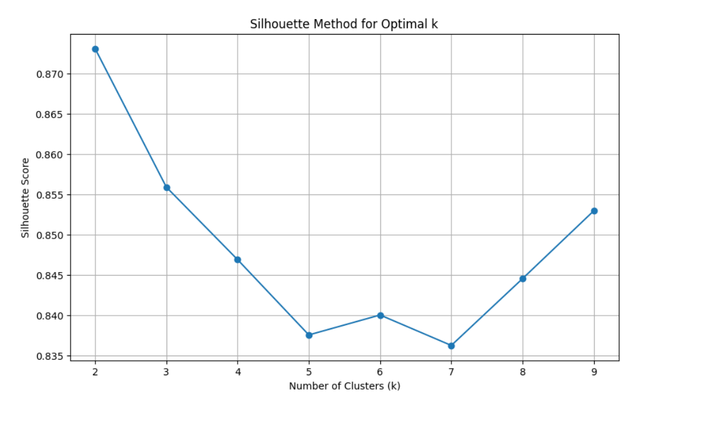
    </p>
    可看出聚类数设为2最好，但最后KMeans的聚类数设为9比2好，可能是因为DBSCAN已经有了一个2聚类数的聚类法。
## 4 模型
### 4.1 模型调研
适用于分类的模型：`XGBoost`，`LightGBM`，`CatBoost`，`随机森林`，`TabNet`。
- `XGBoost`：中小规模表格数据的回归、分类任务。
- `LightGBM`：大规模稀疏数据，内存消耗少
- `CatBoost`：类别型数据为主的表格数据集
- `随机森林`：对特征重要性分析和解释性要求较高的任务。
- `TabNet`: 数据量非常大，适用于表格数据，对特征工程要求不高

以上为搜索结果，不保证正确性。
### 4.2 模型选择
#### 4.2.1 XGBoost
##### 模型介绍
- **原理**： `XGBoost`由决策树构成，这些决策树即为“弱学习器”，它们共同组成了`XGBoost`。这些组成`XGBoost`的决策树之间是有先后顺序的：后一棵决策树的生成会考虑前一棵决策树的预测结果，即将前一棵决策树的偏差考虑在内，使得先前决策树做错的训练样本在后续受到更多的关注，然后基于调整后的样本分布来训练下一棵决策树。XGBoost是一种提升树模型，即它将许多树模型集成在一起，形成一个很强的分类器。
- **选择依据**：考虑到类型数据较少，筛选出用`XGBoost`，`LightGBM`，`TabNet`模型，考虑到复杂度，筛选出`XGBoost`和`LightGBM`模型，考虑到`XGBoost`模型参数调整可能更灵活，最终选用使用`XGBoost`模型进行训练。
**注：在最初尝试时发现添加parquet数据结果并未有什么提升，可能是因为parquet数据数量较少，加上只是仪器结果，与网瘾没有直接关系。所以在XGBoost后续正式实验中抛弃了该部分数据**
##### 数据预处理
- **数据选择**
  - 由于有的行特征缺失值过多，选取缺失值数量小于`71`的行。
-  **缺失值处理**
   - 缺失项过多，不能直接舍弃，加上数据影响结果，所以若采用均值填充等，可能会导致数据缺乏特殊性，脱离了和结果的关系。
   - 考虑到相同`sii`结果的数据可能具有相似性，或者相似数据会导致相同结果`sii`，故根据不同数据之间的相似度进行填充。采用**图结构**的思想。采用`KNNImputer`对数据进行填充，选取相似度最高的`5`组数据
- **处理完缺失值进行特征处理**
##### 模型输入数据
直接将每一行处理过的数据作为输入
<P align='center'>
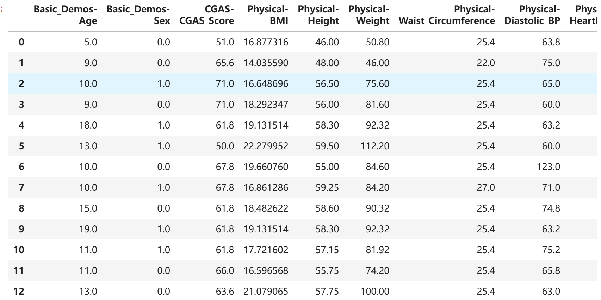
</p>

##### 训练与测试
- **训练数据的划分**
为了使在训练过程中，不同的划分集合中数据的分布保持一致，采用`StratifiedKFold`的方式，将数据化分成5份。
每次将一份数据划分成训练部分和测试部分，进行训练。

- **评价指标**
采用`quadratic weighted kappa`，评估预测值与真实值之间的相似度。采用`cohen_kappa_score`函数，与权重参数`weights='quadratic'`结合可以处理分类的偏差。除此之外，采用`precision`指标来评估每次训练的准确度。
```python
def quadratic_weighted_kappa(y_true, y_pred):
    return cohen_kappa_score(y_true, y_pred, weights='quadratic')
```

- **参数初始设置**
``` python
XGB_Params = {
    'learning_rate': 0.05,  # 学习率
    'max_depth': 6,     # 树的最大深度
    'n_estimators': 200, # 树的数量
    'subsample': 0.8,   # 子采样比例
    'colsample_bytree': 0.8,   # 列采样比例
    'reg_alpha': 1,     # L1正则化项系数
    'reg_lambda': 5,    # L2正则化系数
    'random_state': SEED,  # 随机种子，防止过拟合
    'tree_method': 'gpu_hist',
}
 ```
初始化参数如上，在训练过程的`log`信息为
```
2024-12-15 04:58:26 - INFO - ********** Logging initialized **********
2024-12-15 04:58:30 - INFO - {'learning_rate': 0.05, 'max_depth': 6, 'n_estimators': 200, 'subsample': 0.8, 
'colsample_bytree': 0.8, 'reg_alpha': 1, 'reg_lambda': 5, 'random_state': 42, 'tree_method': 'gpu_hist'}
2024-12-15 04:58:31 - INFO - Fold 1 - Train QWK: 0.9333, Validation QWK: 0.5754, 
Validation Precision: 0.6861
2024-12-15 04:58:32 - INFO - Fold 2 - Train QWK: 0.9413, Validation QWK: 0.5408,
Validation Precision: 0.6631
2024-12-15 04:58:33 - INFO - Fold 3 - Train QWK: 0.9402, Validation QWK: 0.4857, 
Validation Precision: 0.6248
2024-12-15 04:58:33 - INFO - Fold 4 - Train QWK: 0.9488, Validation QWK: 0.5280,
 Validation Precision: 0.6631
2024-12-15 04:58:34 - INFO - Fold 5 - Train QWK: 0.9469, Validation QWK: 0.4816, 
Validation Precision: 0.6104
```
`log`信息解释：
 - Train QWK：是指在训练过程中划分得到的训练集的`quadratic weighted kappa`值，`Quadratic Weighted Kappa (QWK) `用于衡量两个评分者（或模型预测和真实标签）之间的一致性，该指标越接近1越好，为1说明完全一致，在该实验中训练集结果达到了`0.9`
 - Validation QWK: 是指在训练过程中划分得到的验证集的`quadratic weighted kappa`值
 - Validation Precision：是指在训练过程中划分得到的验证集的准确度，使用`Precision`指标。

**提交得分：0.411**

##### 数据过采样处理(另一种方式)

在训练过程中，不同结果数据的比例不同，`0`,`1`较多，可能导致训练的模型对在这些数据具有偏好性，考虑到`2`，`3`类型的数据过少，所以采用过采样的方式，生成新的数据，使结果更均衡。过采样方式选取`SMOTE`
```python
smote = SMOTE(random_state=42)
X_resampled, y_resampled = smote.fit_resample(X, y)
```

**提交得分：0.395**
- 分析：由于特征过多，不同特征之间关联不够明显，所以根据已有数据进行数据生成结果不可信，并且结果没有进行过测试，所以结果反而变差。
- 放弃对数据进行过样本处理。
##### 微调

微调`XGBoost`的参数为
```python
XGB_Params = {
    'learning_rate': 0.01,
    'max_depth': 7,
    'n_estimators': 300,
    'subsample': 0.6,
    'colsample_bytree': 0.6,
    'reg_alpha': 0.5,  
    'reg_lambda': 2,  
    'random_state': SEED,
    'tree_method': 'gpu_hist',
}
```
- 分析：增加树的深度来捕捉更多的非线性特征，增加树的数量来增加模型复杂度，降低采样比例，来提高模型的泛化程度，但是更容易过拟合。
- 最终结果有提升。
  
**提交得分：0.423**

##### 数据样本处理（优化）

如下图所示，下图为每一行数据中缺失值的数量。对训练集中每一行数据，存在大量缺失情况，对这些数据进行了填充，但填充结果可能与实际结果不同，从而影响模型的准确度，因此对数据进行筛选。
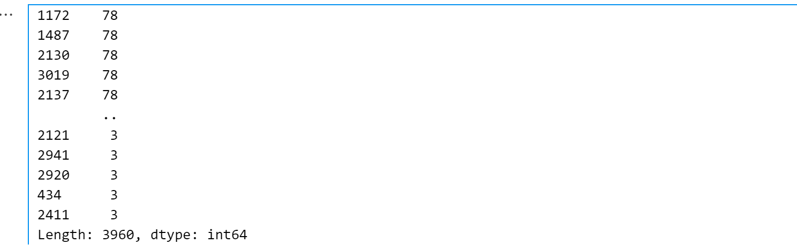

在以上模型中，采用`train.csv`中缺失值小于`71`的行，最优得分为**0.423**
进一步缩小训练集，选取`train.csv`中缺失值小于`61`的行，得分为**0.429**，可知对训练集进行筛选，可以降低填充数据不准确性的影响。由于提交次数有限，没有进行进一步测试。

##### 模型输出结果
首先对于不同的结果（0，1，2，3），分别设置对应的范围（阈值），模型预测结果为一个数字，对该数字进行处理，如果该数字在某个结果的范围内，则预测为该结果。
最优模型输出结果（前面为id，后者为预测的结果）：
<P align='center'>
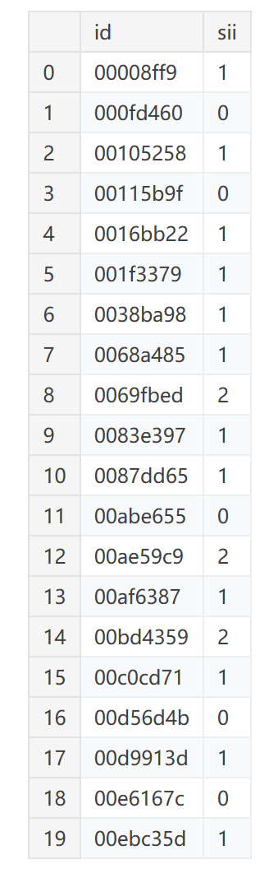
</p>

##### 反思
仅使用`XGBoost`模型进行训练，分别采用不同的数据采样方式，参数值进行预测并进行结果比较。最初我只是简单对数据进行预测，后来参考别人的代码优化了一下，使用门限值进行类别选择，为不同结果规定预测范围并不断调整，最终采取最优的预测作为最终结果。在此过程中，我构造的特征类型较少，主要采取了主观上更明显的特征，可能影响了最终结果。此外，可能使用`TabNet`模型更优。

#### 4.2.2 集成学习
**LightGBM与XGBoost用投票回归器(VotingRegressor)集成**
参数选择：
```
LGBM_Params = {
    'learning_rate': 0.04,
    'max_depth': 12,
    'num_leaves': 413,
    'min_data_in_leaf': 14,
    'feature_fraction': 0.8,
    'bagging_fraction': 0.76,
    'bagging_freq': 2,
    'lambda_l1': 4.735,
    'lambda_l2': 4.735e-06,
    'random_state': SEED}
XGB_Params = {
    'learning_rate': 0.04,
    'max_depth': 6,
    'n_estimators': 200,
    'subsample': 0.8,
    'colsample_bytree': 0.8,
    'reg_alpha': 1,  # Increased from 0.1
    'reg_lambda': 5,  # Increased from 1
    'random_state': SEED}
```
其中SEED为42。
#### 训练与测试
- **训练数据的划分**
为了使在训练过程中，不同的划分集合中数据的分布保持一致，采用`StratifiedKFold`的方式，将数据化分成5份。
每次将一份数据划分成训练部分和测试部分，进行训练。
训练过程的`log`信息为：
```
168.7s	1008	Fold 1 - Train QWK: 0.8932, Validation QWK: 0.3517
177.3s	1009	Fold 2 - Train QWK: 0.8979, Validation QWK: 0.3795
185.5s	1010	Fold 3 - Train QWK: 0.8982, Validation QWK: 0.3697
194.0s	1011	Fold 4 - Train QWK: 0.8889, Validation QWK: 0.4028
202.6s	1012	Fold 5 - Train QWK: 0.8941, Validation QWK: 0.4109
```
提交得分：**0.419**

#### 4.3 两种模型的对比
采用`XGBoost`和`LightGBM`集成的方式与初始时采用`XGBoost`模型对比（此时的参数和集成方式相似），可以得到集成方式结果更优`0.419 > 0.411`。具体可能原因如下
- 特征工程构造不同，在集成部分构造出了更多的特征，数据属性之间的关联度提高，可能更有利于模型学习数据特征。
- `LightGBM`和`XGBoost`两者的分裂策略和优化方式存在差异，两者结合可以从不同角度出发，结合多个模型的预测结果，弥补单个模型的不足，更容易捕获特征。
- 单个模型通常会有偏差（bias）和方差（variance），尤其是在数据噪声较多或分布复杂时，可能导致不稳定的预测。VotingRegressor 使用多个模型的输出进行加权平均或简单平均，从而平滑各模型的偏差和方差。（这点检索得到）
## 5 小组分工
- **PB22111644 姬子琢**:`3.2`和`4.2.2`部分报告书写。两种模型集成，`XGB-LIGHT.ipynb`的代码。
- **PB22111639 马筱雅**：除`3.2`和`4.2.2`部分外其余部分报告书写，模型比较，`XGBoost`模型多个方向的尝试和优化，数据的分析及绘图，`XGBoost.ipynb`和`data-analysis.ipynb`部分代码。

## 个人心得

-  **PB22111639 马筱雅**：在本次实验中，我主要学习了`XGBoost`的使用，特征工程的构造，积累了一点微调参数的经验。在训练部分，参考了别人的方式对我原本的代码进行优化（即采用门限值处理预测数据），同时也学习到了这种解决问题的方式。我也掌握了一些处理数据的方式，更熟悉了对一些库的应用，但是对于如何构造特征，我还比较陌生，需要在以后的学习实践中加强学习。
  
-  **PB22111644 姬子琢**：在这次比赛过程中，我学习了特征工程里特征的设计与选择、模型的集成，了解了机器学习的基本流程，在数据分析与特征选择上还有不足。

