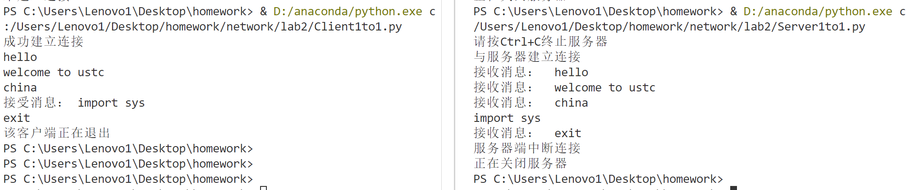
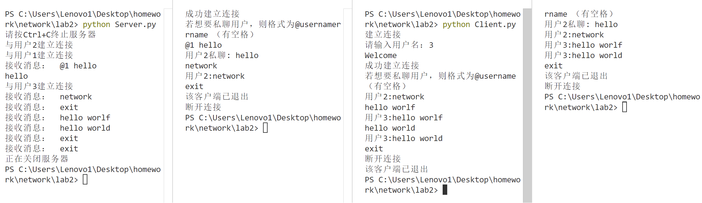

## LAB2 Report
<p align="right">PB22111639 马筱雅</p>

#### 实验平台
- 实验环境：`Windows`
- 编程环境：`python`
#### 实验内容
- 简单聊天程序
    - 客户端输入`exit`即可关闭连接
    - 服务器输入`Ctrl C`即可关闭（最好在客户端关了之后再关闭服务器）
    - 一个客户端关闭后需要对服务器端输入enter，从而关闭服务器。
- 高级聊天程序（选做）
    - 客户端输入`@username `可以实现私聊（用户名后需有一个空格）
    - 客户端输入`exit`可以关闭连接
    - 服务器输入`Ctrl C`即可关闭（最好在客户端关了之后再关闭服务器）

#### 关键代码解释
##### 简单聊天程序
客户端包含发送信息和接收信息两个功能，创建`Client`类。
**建立连接**
```python
    self.client_socket = socket.socket(socket.AF_INET, socket.SOCK_STREAM)
    self.client_socket.connect((IP, PORT))
```

**多线程**
客户端接收信息和发送信息各占一个线程

```python
    receive_thread = threading.Thread(target=client.receive)
    receive_thread.start()
```

```python
    send_thread = threading.Thread(target=client.send)
    send_thread.start()
```

**关闭连接**
当客户端输入`exit`时关闭连接
```python
self.client_socket.close()
```
对于接收程序，捕捉错误信息，当客户端关闭连接时，接收程序出错，从而结束该线程，使用`try`和`except`来捕获异常。
```python
    while True:
        try:
            data = self.client_socket.recv(BUFFER_SIZE)
            data = data.decode()
            print("接受消息：", data)
        except:
            break
```

**服务器**
- 首先需要设置监听端口，等待连接
```python
    self.socket = socket.socket(socket.AF_INET, socket.SOCK_STREAM)
    self.socket.bind((IP, PORT))
```
- 设置信号捕获机制，当输入`Ctrl C`时，关闭服务器。
```
    signal.signal(signal.SIGINT, shutdown_server)
    signal.signal(signal.SIGTERM, shutdown_server)
```
发送消息、接收消息类似客户端
##### 高级聊天程序
**服务器**
- 服务器端接收到`Ctrl+C`后关闭服务器，因此需要代码等待信号，在主线程等待信号，捕获信号后执行关闭服务器操作。
```python
    signal.signal(signal.SIGINT, shutdown_server)
    signal.signal(signal.SIGTERM, shutdown_server)
    print("请按Ctrl+C终止服务器")
    while True:
        try:
            # 主线程等待信号
            time.sleep(1) # 等待信号到来
        except KeyboardInterrupt:
            pass
```
- 每次接受一个连接，需要建立一个子线程，负责接收该客户端发来的消息，并将该连接对应的用户名和`connection`添加进用户`clients`的字典中。
```python
    clients[username] = (conn, addr)
    thread = threading.Thread(target=self.receive, args=(username, conn, addr))
    thread.start()
```
- 广播机制，对于`clients`里的所有用户，均发送消息，采用一层循环进行遍历。
```python
    def broadcast(self, user, message):
        for name, client in clients.items():
            client[0].send((f"用户{user}:" + message).encode())
```
- 私聊： 如果消息的开头为`@`，则找到对应的用户名，根据`clients`找到对应的连接，然后进行发送消息。（这种方式可能导致不能发送`@`开头的语句，如果建立图形界面，大致能解决）
```python
    if msg[0] == "@":
        name = msg.split(' ')[0][1:]
        if name in clients.keys():
            (client, client_addr) = clients[name]
            index = msg.find(' ')
            print(msg[index+1:])
            client.send((f"用户{user}私聊: "+msg[index+1:]).encode())
            conn.send((f"用户{user}私聊: "+msg[index+1:]).encode())
        else:
            conn.send(f"不存在用户名为{name}的用户".encode())
```

**客户端**
- 对于发送和接收信息，均开启一个新的线程，分别用于以上两个功能。
```python
    receive_thread = threading.Thread(target=client.receive)
    receive_thread.start()

    send_thread = threading.Thread(target=client.send)
    send_thread.start()
```
- 断开连接，发送`exit`，发送`exit`后，调用`close`函数断开连接并退出循环，则该发送消息`send`线程运行结束。对于接受线程，若连接被关闭，则捕获到异常，则退出循环，接收消息的线程结束。
```python
    def receive(self):
        while True:
            try:
                data = self.client_socket.recv(BUFFER_SIZE)
                data = data.decode()
                print(data)
            except:
                # if self.client_socket.shutdown
                print("断开连接")
                break
    
    def send(self):
        while True:
            message = input()
            try:
                self.client_socket.send(message.encode())
                if message == "exit":
                    self.client_socket.close()
                    print("该客户端已退出")
                    break
            except:
                break
```


#### 实验结果
##### 简单聊天程序

##### 高级聊天程序

